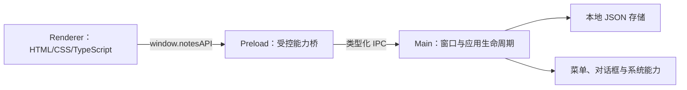

# Electron 教程架构设计

## 目标

本版本新增一套面向前端开发工程师的 Electron 教程。教程以一个本地笔记桌面应用为贯穿式 demo，读者最终能够独立设计进程边界、安全 IPC、原生桌面集成和可分发安装包。

## 产物边界

```text
docs/docs/production/electron/   教程正文、章节、术语表和环境附录
examples/electron-notes/         可直接安装、运行和构建的统一 demo
```

版本目录只记录本次文档版本的架构与计划；已交付的教程正文归档到 `production/electron`，示例工程不混入文档目录。

## 运行时架构



渲染进程不直接访问 Node.js。preload 只暴露完成用例所需的窄接口；主进程验证来自 IPC 的输入并持有文件系统和原生能力。

## 教学架构

课程按依赖顺序增量演进同一个 demo：

1. 建立 Electron 进程模型与最小窗口。
2. 用 preload 和 IPC 连接 Web UI 与桌面能力。
3. 实现本地持久化与错误边界。
4. 接入窗口、菜单和对话框。
5. 收紧安全边界并建立调试方法。
6. 完成构建、打包与发布准备。

每章包含可观察目标、执行路径、动手任务和命令级验收。最终环境固定依赖版本，并通过格式检查、静态分析、自动验证和打包命令验收。
