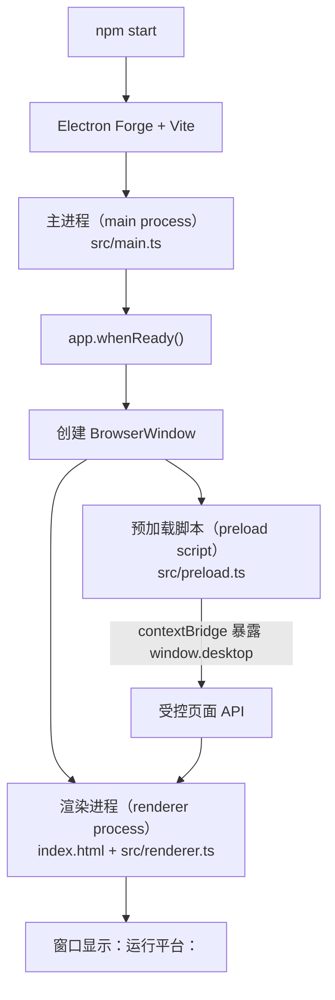
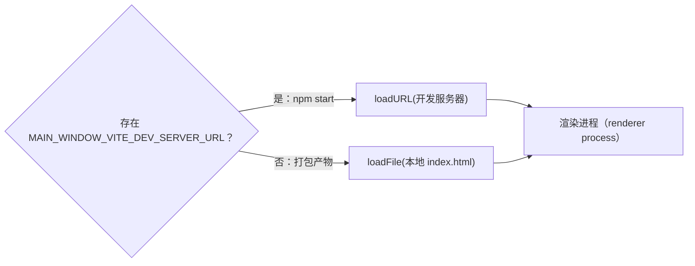

# 第 1 章：Electron 心智模型与最小运行闭环

## 本章目标

完成本章后，你能够：

- 启动 `examples/electron-notes`，并从终端、窗口和页面文字判断最小闭环是否运行成功；
- 区分主进程（main process）、渲染进程（renderer process）和预加载脚本（preload script）的职责；
- 沿着 `package.json` → `src/main.ts` → `src/preload.ts` → `index.html` / `src/renderer.ts` 解释启动路径；
- 在不向页面开放 Node.js 的前提下，经由 `contextBridge` 展示当前平台；
- 根据故障现象判断应先检查哪个入口和执行环境。

本章不实现笔记读写，也不展开 IPC。目标只有一个：建立一个可启动、可观察、边界清楚的 Electron 最小运行闭环。

## 前置条件

你需要熟悉 HTML、CSS、TypeScript、DOM 查询和 `npm` 脚本。请在项目根目录下工作，并准备：

- Node.js 22；
- npm 10；
- 能显示桌面窗口的 Windows、macOS 或 Linux 图形环境。

本章示例锁定 Electron 43.4.0。实际版本和命令以 `examples/electron-notes/package.json` 与 `package-lock.json` 为准。

## 组件职责与执行路径

Electron 不是“带文件系统 API 的浏览器页面”。它沿用 Chromium 的多进程架构：一个应用有一个主进程，并可为不同页面创建多个渲染进程。当前 demo 只有一个窗口，但仍应按进程边界设计。

| 组件 | 中文 / 英文术语 | 当前入口 | 负责什么 | 不负责什么 |
|---|---|---|---|---|
| 主进程 | 主进程（main process） | `src/main.ts` | 应用生命周期、创建 `BrowserWindow`、选择加载开发服务器或构建后的页面 | 不直接操作页面 DOM |
| 渲染进程 | 渲染进程（renderer process） | `index.html`、`src/renderer.ts` | 展示界面、响应 DOM、消费被允许的桌面能力 | 不直接导入 Node.js 或 Electron 模块 |
| 预加载脚本 | 预加载脚本（preload script） | `src/preload.ts` | 在页面加载前运行，通过窄接口连接受隔离的页面环境与 Electron 能力 | 不是第二个主进程，也不承载完整业务后端 |

Electron 官方进程模型指出：主进程是应用入口，具备 Node.js 环境并通过 `BrowserWindow` 创建页面；每个 `BrowserWindow` 的页面在独立的渲染进程中运行。预加载脚本则在网页内容开始加载之前、渲染进程的上下文中执行，并拥有比普通页面更高的权限。这里的“桥”是职责比喻，不表示三个组件运行在同一个 JavaScript 全局环境。



注意图中的两条并行关系：`BrowserWindow` 配置预加载脚本，同时加载页面；预加载脚本先于网页内容运行。页面最终只看到 `window.desktop`，看不到 preload 内部的 Electron 模块引用。

## 逐步讲解

### 第 1 步：从应用入口开始，而不是从 HTML 开始

`examples/electron-notes/package.json` 的 `main` 指向 `.vite/build/main.js`。它是 Forge/Vite 从 `src/main.ts` 构建出的主进程入口。执行：

```powershell
cd examples/electron-notes
npm ci
npm start
```

`npm start` 调用 `electron-forge start`。Forge 先为 main、preload 和 renderer 准备各自的构建目标，再启动 Electron。与普通 Vite Web 项目不同，Electron 必须先进入主进程入口，页面不能自己创建原生窗口。

### 第 2 步：等待 Electron 就绪，再创建窗口

`src/main.ts` 在 `app.whenReady()` 完成后调用 `createWindow()`。`app.whenReady()` 返回的 Promise 在 Electron 初始化完成时兑现；把窗口创建放在这里，可确保相关模块已就绪。

`createWindow()` 创建一个 `BrowserWindow`，同时声明三项关键边界：

```ts
webPreferences: {
  preload: path.join(__dirname, 'preload.js'),
  contextIsolation: true,
  nodeIntegration: false,
  sandbox: true,
}
```

- `preload` 指定构建后的预加载脚本；
- `contextIsolation: true` 让预加载脚本和页面运行在不同 JavaScript context；
- `nodeIntegration: false` 不向页面开放 Node.js；
- `sandbox: true` 对该渲染进程启用 Chromium sandbox。

这些配置共同构成边界，不能把“使用了 `contextBridge`”误认为应用已经自动安全。暴露哪些能力、如何校验输入仍由应用代码负责。

### 第 3 步：开发与构建使用不同页面地址

开发时，Forge 注入 `MAIN_WINDOW_VITE_DEV_SERVER_URL`，主进程通过 `loadURL()` 加载 Vite 开发服务器。打包后没有该地址，主进程改用 `loadFile()` 加载构建产物中的 `index.html`。



这也是排错线索：开发时白屏，先看 Vite 服务地址和终端构建错误；只有打包后白屏，优先检查 `loadFile()` 指向的构建路径。

### 第 4 步：用 preload 暴露最小能力

`src/preload.ts` 读取 `process.platform`，并用 `contextBridge.exposeInMainWorld()` 把一个只读值映射到页面可见的 `window.desktop`：

```ts
contextBridge.exposeInMainWorld('desktop', {
  platform: process.platform,
});
```

开启 context isolation 后，preload 与页面不共享同一个 `window`。因此不能依赖 `window.desktop = ...` 直接赋值；应使用 `contextBridge`。当前接口只暴露展示所需的平台字符串，没有把 `process`、`require` 或完整 Electron API 交给页面。

`src/global.d.ts` 扩展了 TypeScript 的 `Window` 类型。它只提供编译期声明，不会在运行时创建 `window.desktop`；运行时值来自 preload。

### 第 5 步：renderer 只做 Web UI 工作

`index.html` 提供 `#status` 节点并加载 `src/renderer.ts`。renderer 查询 DOM，然后读取桥接值：

```ts
const status = document.querySelector<HTMLParagraphElement>('#status');
if (status) status.textContent = `运行平台：${window.desktop.platform}`;
```

如果 Windows 上看到“运行平台：win32”，这个结果已经穿过完整路径：主进程创建窗口 → preload 暴露平台 → renderer 更新 DOM。这里没有跨进程消息；值在 preload 初始化时经 context bridge 复制到页面环境。动态调用和 IPC 留到后续章节。

### 第 6 步：理解窗口关闭的跨平台行为

关闭所有窗口时，`window-all-closed` 处理器在非 macOS 平台调用 `app.quit()`。macOS 通常保留应用进程；Dock 再次激活应用时，`activate` 处理器会在没有窗口的情况下重新创建一个窗口。这是官方 quick start 采用的跨平台生命周期模式。

## 最小示例：平台信息闭环

本章不复制一套玩具代码，直接使用统一 demo 的当前文件：

```text
examples/electron-notes/
├── package.json                 # 启动脚本与 Electron 入口
├── forge.config.ts              # main、preload、renderer 三类构建目标
├── index.html                   # 页面骨架
└── src/
    ├── main.ts                  # 创建窗口并加载页面
    ├── preload.ts               # 暴露 window.desktop.platform
    ├── renderer.ts              # 把平台写入 #status
    ├── global.d.ts              # window.desktop 的类型声明
    └── styles.css               # 页面样式
```

运行：

```powershell
cd examples/electron-notes
npm ci
npm start
```

预期结果：出现标题为 “Electron Notes” 的桌面窗口，页面包含“本地笔记”，状态文字由“正在连接桌面运行时…”变为当前平台。例如 Windows 对应 `运行平台：win32`，macOS 对应 `darwin`，Linux 对应 `linux`。平台标识来自 Node.js 的 `process.platform`，不是面向最终用户的操作系统品牌名。

## 教学 demo：追踪一次启动

这次实验不修改示例代码。按顺序完成并记录观察结果：

1. 在 `examples/electron-notes` 执行 `npm start`。
2. 观察终端：确认 Forge/Vite 完成 main、preload、renderer 的启动构建。
3. 观察窗口：确认标题、主标题和平台状态均出现。
4. 关闭唯一窗口。Windows/Linux 上确认应用退出；macOS 上确认应用仍可从 Dock 激活并重新创建窗口。
5. 若窗口未出现，按“主进程入口 → 窗口创建 → 页面加载 → preload → renderer DOM”顺序定位，而不是先改 CSS。

这个 demo 的教学价值在于建立因果链：终端构建成功只说明入口可被准备；窗口出现说明主进程和 `BrowserWindow` 路径成功；平台文字出现才说明 preload 与 renderer 也完成了闭环。

## 精简 demo 代码说明书

### 目的

验证主进程（main process）、预加载脚本（preload script）和渲染进程（renderer process）可以在保留安全边界的情况下共同完成一个可观察结果。

### 目录与关键文件

- `package.json`：固定依赖，提供 `start` 和验证脚本；
- `forge.config.ts`：声明 Vite 对 main、preload、renderer 的构建入口；
- `src/main.ts`：等待应用就绪、创建窗口、选择页面来源；
- `src/preload.ts`：只暴露 `{ platform }`；
- `index.html` 与 `src/renderer.ts`：提供 DOM 并显示平台；
- `src/global.d.ts`：确保 renderer 对桥接 API 有静态类型。

### 运行前提与命令

在支持图形界面的环境中使用 Node.js 22 和 npm 10：

```powershell
cd examples/electron-notes
npm ci
npm run verify
npm start
```

### 预期结果

`npm run verify` 无 ESLint 或 TypeScript 错误。`npm start` 打开窗口，`#status` 显示 `运行平台：<process.platform>`，且页面中不能直接使用 `require`。

### 关键执行路径

`npm start` → Forge/Vite 构建入口 → Electron 执行 main → `app.whenReady()` → `BrowserWindow` → preload 暴露 `window.desktop` → renderer 更新 `#status`。

### 教学简化

当前 demo 保留了 context isolation、关闭 Node integration、sandbox 和 CSP；刻意省略了业务 IPC、输入校验、持久化、日志、自动化 UI 测试、异常恢复和发布签名。后续章节会在同一个工程上逐步加入这些生产要素。

### 动手修改

不改变进程边界，为页面增加一行“架构：<process.arch>”。思考 `process.arch` 应在哪里读取、通过什么形状的接口暴露、需要怎样更新 `global.d.ts`，以及 renderer 为什么不应直接读取 `process.arch`。

### 验收方法

运行 `npm run verify`，再执行 `npm start`。通过条件是静态检查成功、原有平台文字仍正确、新增架构文字与运行环境一致，并且 renderer 源码没有导入 Node.js 或 Electron 模块。

## 工程实践

### 把边界配置写死在窗口创建处

不要依赖 Electron 默认值表达安全意图。显式保留 `contextIsolation: true`、`nodeIntegration: false` 和 `sandbox: true`，代码审查时即可看到 renderer 的权限模型。

### 让 preload API 保持窄且面向用例

当前页面只需平台值，就只暴露平台值。生产代码不要暴露整个 `ipcRenderer`、`process` 或通用 `send(channel, data)`；后续加入 IPC 时，应为每个允许的用例提供具体方法，并在主进程验证输入。

### 分清构建期类型与运行时值

`global.d.ts` 不提供实现。若类型检查通过但页面报 `window.desktop` 为 `undefined`，应检查 preload 是否被正确构建和加载，而不是继续扩展类型声明。

### 用分层现象缩小故障范围

| 现象 | 已证明 | 优先检查 |
|---|---|---|
| Forge/Vite 构建失败 | 尚未进入可靠运行阶段 | 依赖、TypeScript、构建配置 |
| 构建成功但无窗口 | 工具链大致可用 | main 异常、`whenReady`、`BrowserWindow` |
| 窗口出现但白屏 | main 与窗口创建成功 | `loadURL` / `loadFile`、renderer 构建、CSP |
| 初始文字不变或 `desktop` 未定义 | HTML 已加载 | preload 路径、preload 异常、bridge 名称 |
| 平台文字正常 | 最小闭环完整 | 可进入下一层功能开发 |

## 常见错误

### 把 preload 当成独立进程

preload 不是第三种操作系统进程。它运行在渲染进程中，但在网页内容之前执行，并在 context isolation 开启时处于隔离的 JavaScript context。这个区别决定了它能准备桥接 API，却不应取代主进程管理应用生命周期。

### 在 renderer 中直接导入 `node:fs`

当前配置关闭 Node integration，这样做会失败，而且破坏既定架构。需要系统能力时，应由 preload 暴露窄接口；涉及主进程能力时，再通过受控 IPC 完成。

### 只改 `global.d.ts` 就期待 API 出现

声明文件会让 TypeScript 接受 `window.desktop`，但浏览器运行时不会因此产生属性。属性名在 `preload.ts` 与 `renderer.ts` 之间必须完全一致。

### 在 `app.whenReady()` 之前随意创建窗口

窗口和许多 Electron API 应在应用 ready 后使用。当前入口已把 `createWindow()` 放在 `whenReady()` 的回调中，不要为了“更早执行”把它移到模块顶层。

### 把开发服务器路径当成打包路径

`loadURL()` 服务于开发模式，`loadFile()` 服务于构建产物。修复某一种模式时不要删除另一条分支；最终打包需要本地文件路径。

### 看到窗口就判定全部成功

窗口出现只验证了 main 到 `BrowserWindow` 的部分路径。只有平台文字成功更新，才能证明 preload 和 renderer 也完成最小闭环。

## 动手任务

### 任务 A：画出职责边界

不看本章图表，用三到五个节点画出平台文字从来源到 DOM 的路径。每条边标注“创建”“暴露”或“读取”，并指出哪些节点属于同一个渲染进程、哪些 JavaScript context 相互隔离。

### 任务 B：完成架构信息扩展

按 demo 说明书增加 `process.arch`，但满足以下约束：

- renderer 不导入 Node.js 或 Electron；
- preload 不暴露整个 `process`；
- `Window` 类型与运行时 API 一致；
- 原有平台展示不回归。

### 任务 C：做一次可恢复故障实验

临时让 renderer 读取一个不存在的 bridge 属性，观察窗口和 DevTools 中的错误，再恢复修改。说明为什么 TypeScript 通常会在运行前阻止这个错误；如果用类型断言绕过检查，哪一层仍会失败。不要提交故障代码。

## 客观验收

在 `examples/electron-notes` 目录执行：

```powershell
npm run verify
npm start
```

本章通过条件：

- `npm run verify` 退出码为 0；
- 启动后出现 “Electron Notes” 窗口；
- 页面显示“本地笔记”和 `运行平台：<platform>`；
- 你能从入口文件逐段解释该文字为何出现，并正确指出 preload 运行在渲染进程而非主进程；
- 你能说明 `contextIsolation`、`nodeIntegration` 与 `sandbox` 各自约束的对象；
- 若完成架构信息扩展，`npm run verify` 仍通过，且 renderer 没有 Node.js / Electron import。

自动检查不能验证窗口是否真实显示，因此 `npm start` 的界面观察是本章必要的手工验收。若当前环境没有图形界面，应如实记录 UI 未验证，并在桌面环境重跑该命令。

## 官方来源

- [Process Model](https://www.electronjs.org/docs/latest/tutorial/process-model)：主进程、渲染进程和 preload 的运行模型。
- [Building your First App](https://www.electronjs.org/docs/latest/tutorial/tutorial-first-app)：应用入口、`BrowserWindow`、应用生命周期与跨平台关闭行为。
- [Using Preload Scripts](https://www.electronjs.org/docs/latest/tutorial/tutorial-preload)：preload、页面能力暴露与进程职责边界。
- [Context Isolation](https://www.electronjs.org/docs/latest/tutorial/context-isolation)：隔离 context、`contextBridge` 和窄接口安全建议。
- [Process Sandboxing](https://www.electronjs.org/docs/latest/tutorial/sandbox)：renderer sandbox 的能力限制与配置。
- [`app` API](https://www.electronjs.org/docs/latest/api/app)：`whenReady()`、`activate` 与 `window-all-closed` 的准确语义。
- [`BrowserWindow` API](https://www.electronjs.org/docs/latest/api/browser-window)：窗口创建和 `webPreferences` 配置。

## 下一章衔接

你现在拥有的是“能启动并显示平台”的骨架。下一章将在不改变三类组件职责的前提下扩展窗口和页面结构，进一步理解 `BrowserWindow` 的创建、加载与生命周期。之后再引入类型化 IPC，让笔记 UI 请求主进程能力。
