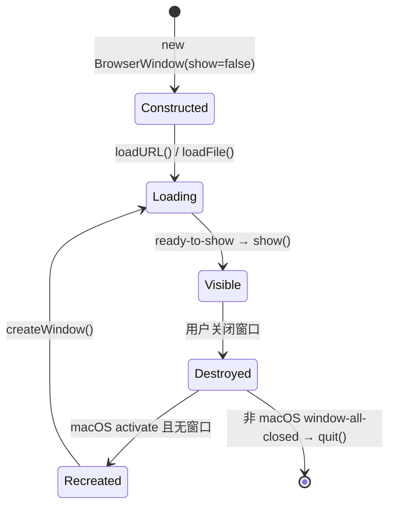
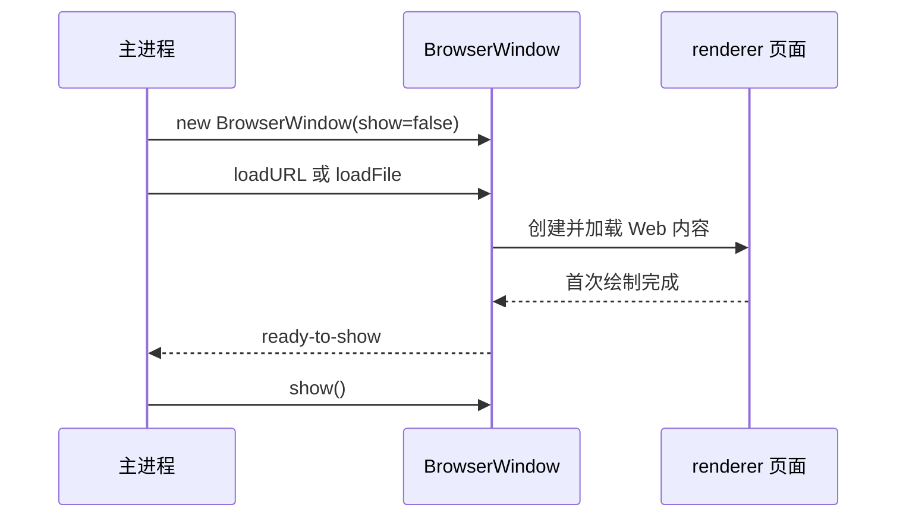
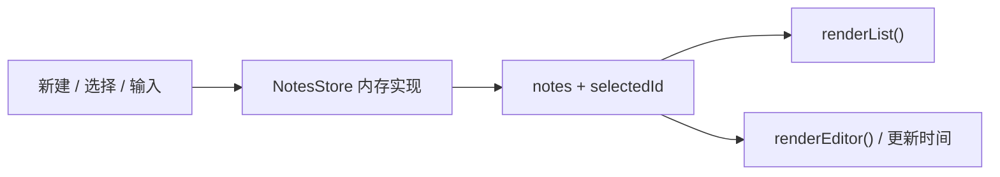

# 第 2 章：BrowserWindow 生命周期与笔记界面

## 本章目标

完成本章后，你能够：

- 解释 `BrowserWindow` 从创建、加载、显示到销毁的关键阶段；
- 用 `ready-to-show` 避免窗口在首帧尚未绘制时提前出现；
- 构建包含笔记列表、编辑器、新建与选择操作的可用桌面界面；
- 把 renderer 的内存数据操作收口为一个可替换接口，为下一章 IPC 留出接缝；
- 通过窗口尺寸、键盘焦点、空状态与打包结果验收本章 demo。

本章只处理窗口和 Web UI。笔记数据仍在 renderer 内存中；关闭应用后不会保留。IPC、文件系统和持久化从第 3 章开始。

## 前置条件

完成第 1 章，并能区分主进程（main process）、渲染进程（renderer process）和预加载脚本（preload script）。你还应熟悉 DOM event、TypeScript interface、CSS Grid 和 npm 脚本。本章继续使用统一工程 `examples/electron-notes`，版本以其 `package.json` 和锁文件为准。

## 组件职责与执行路径

| 组件 | 本章职责 | 边界 |
|---|---|---|
| `src/main.ts` | 创建 `BrowserWindow`，设置窗口约束，在页面可展示时显示窗口 | 不持有笔记数据，不操作 DOM |
| `index.html` | 提供列表、空状态和编辑表单的语义结构 | 不写交互逻辑 |
| `src/renderer.ts` | 管理内存笔记、选择状态、DOM 渲染和输入事件 | 不导入 Electron 或 Node.js，不做持久化 |
| `src/styles.css` | 建立双栏布局、交互状态和响应式约束 | 不决定业务状态 |



`BrowserWindow` 是主进程对象。页面加载后，Electron 为其 Web 内容运行 renderer。窗口对象的生命周期和页面中的笔记状态不是同一件事：窗口关闭会销毁 renderer，因而本章的内存数组也随之消失。

## 逐步讲解

### 第 1 步：先声明窗口约束

`src/main.ts` 把默认尺寸设为 `1180 × 760`，最小尺寸设为 `820 × 600`。默认尺寸为首次展示提供舒适的双栏空间；最小尺寸则是布局契约，防止侧栏和编辑器被挤到不可操作。

```ts
const window = new BrowserWindow({
  title: 'Electron Notes',
  width: 1180,
  height: 760,
  minWidth: 820,
  minHeight: 600,
  show: false,
  backgroundColor: '#f4f1e8',
  // webPreferences 保持第 1 章的安全边界
});
```

`backgroundColor` 应接近页面背景色。即使页面加载或绘制有短暂间隔，原生窗口底色也不会形成刺眼的白色闪烁。

### 第 2 步：页面准备好后再显示

`show: false` 让新窗口先保持隐藏；`ready-to-show` 表示页面已完成首次绘制、窗口可在不产生视觉闪烁的情况下显示。本 demo 只需要响应一次，因此使用 `once`：

```ts
window.once('ready-to-show', () => window.show());
```

不要把 `ready-to-show` 理解为“所有业务数据已加载”。它与 renderer 首次绘制有关。生产应用若必须尽快反馈启动状态，可以直接显示带 `backgroundColor` 的窗口并在页面中呈现 loading UI；两种策略取决于启动体验，而不是安全边界。

### 第 3 步：保留开发与打包两条加载路径

第 1 章的 `loadURL()` / `loadFile()` 分支保持不变。`loadURL()` 返回 Promise，`ready-to-show` 则是窗口事件；两者描述不同观察点。本章不等待加载 Promise 再调用 `show()`，因为目标是以首帧可展示作为显示条件。



### 第 4 步：用语义 HTML 划分导航和编辑区

`index.html` 的根布局由 `aside.sidebar` 和 `section.workspace` 构成。笔记集合使用带 `aria-label` 的 `nav`，编辑区使用 `form`、显式 label 和原生 `input` / `textarea`。原生控件已经具备键盘输入能力，不需要用 `div[contenteditable]` 重做编辑器行为。

空状态与编辑器同时存在于 DOM，由 `hidden` 属性控制可见性。这让 renderer 只切换状态，无需不断拼接大段 HTML。

### 第 5 步：让 renderer 拥有清晰的数据接口

`renderer.ts` 定义 `Note` 与一个很小的 `NotesStore`：

```ts
interface NotesStore {
  list(): Note[];
  create(): Note;
  update(id: string, patch: Pick<Note, 'title' | 'body'>): Note | undefined;
}
```

当前实现直接操作模块内数组，这是刻意的教学简化。界面代码只通过 `store.list/create/update` 表达意图；下一章可把这些操作替换为异步的 `window.notesAPI`，而 DOM 结构和交互语义不必推倒重来。这里没有建立 class、repository 或全局状态框架，因为三个用例尚不需要那些层次。

### 第 6 步：从状态派生列表和编辑器

`selectedId` 是唯一的页面选择状态。`renderList()` 根据数组创建安全的 DOM 节点，并用 `textContent` 写入用户内容；`renderEditor()` 根据 `selectedId` 决定显示空状态还是表单。选中卡片时，两部分一起重绘：



输入事件会立即更新内存数据，并刷新左侧标题与预览。刷新列表不会替换正在输入的 `input` 或 `textarea`，因此光标和选择范围保持稳定。

### 第 7 步：把视觉状态绑定到语义状态

当前笔记卡使用 `aria-current="true"` 表达选中状态，CSS 用同一个属性绘制高亮；键盘焦点用 `:focus-visible` 清楚呈现。布局使用固定侧栏加弹性工作区，在 900px 以下缩窄侧栏。窗口的 `minWidth` 是最后一道保证，因此无需在本章引入手机式导航。

## 最小示例：延迟显示窗口

只关注生命周期时，最小闭环是：

```ts
const window = new BrowserWindow({ show: false });
window.once('ready-to-show', () => window.show());
void window.loadURL('https://example.com');
```

这个片段说明事件顺序，但教程工程不会加载远程页面。实际 demo 保留 Vite 开发地址与本地构建文件的双路径，以及第 1 章的 preload 与安全配置。

## 教学 demo：内存笔记工作台

### 目的

验证一个 `BrowserWindow` 能以稳定首帧展示可操作的笔记 UI，并让新建、选择、标题编辑和正文编辑在 renderer 内形成完整交互闭环。

### 目录与关键文件

```text
examples/electron-notes/
├── index.html          # 双栏语义结构、空状态、编辑表单
└── src/
    ├── main.ts         # 窗口尺寸、延迟显示与跨平台生命周期
    ├── renderer.ts     # Note、NotesStore、选择状态与 DOM 事件
    └── styles.css      # 桌面布局、选中态、焦点态与响应式约束
```

`preload.ts` 与 `global.d.ts` 沿用第 1 章，只负责展示运行平台；本章没有增加新的桌面能力。

### 运行前提与命令

在 `examples/electron-notes` 目录运行：

```powershell
npm ci
npm run verify
npm start
```

完成界面操作后，关闭开发进程并构建打包目录：

```powershell
npm run package
```

### 预期结果

窗口出现时没有明显的未绘制白屏，初始选中“欢迎来到 Electron Notes”。左侧有两篇示例笔记；编辑标题或正文时，对应卡片立即更新。点击＋后，新笔记被插入列表顶部，标题输入框获得焦点。应用重启后恢复两篇初始笔记，证明本章尚未持久化。

### 关键执行路径

main 创建隐藏窗口 → Vite 页面完成首次绘制 → `ready-to-show` 显示窗口 → renderer 创建初始内存数据 → 渲染列表与选中笔记 → DOM event 调用 store → 从更新后的内存状态刷新 UI。

### 教学简化

保留：安全 `webPreferences`、CSP、最小窗口约束、可见焦点、语义控件、开发与打包路径。刻意省略：IPC、磁盘存储、删除操作、撤销、自动保存失败、并发修改、多窗口同步和自动化 UI 测试。当前“已保存到内存”明确说明保存范围，避免把内存更新伪装成持久化。

### 动手修改

增加“删除当前笔记”按钮。删除后应选中下一篇可用笔记；没有剩余笔记时显示空状态。不要加入 IPC 或文件系统，也不要用 `innerHTML` 渲染用户输入。

### 验收方法

1. `npm run verify` 退出码为 0。
2. `npm start` 后窗口尺寸不小于约束，平台文字正确。
3. 点击＋，出现空白新笔记且标题输入框获得焦点。
4. 输入标题与正文，列表卡片同步更新。
5. 在两篇笔记间切换，各自内容不串写。
6. 缩小窗口至系统允许的最小尺寸，列表与编辑器仍可操作。
7. `npm run package` 退出码为 0，并生成平台对应的打包目录。

## 工程实践

### 不长期持有失效窗口引用

本章的 `window` 是 `createWindow()` 内的局部变量。关闭窗口后对象可被回收；需要单窗口全局引用时，应在 `closed` 后清空引用，避免后续逻辑误用已销毁对象。

### 把显示策略和加载成功分开处理

`ready-to-show` 改善首帧体验，但不替代加载错误处理。生产应用应处理 `did-fail-load`、记录错误并提供可恢复界面。本章为了聚焦生命周期只保留成功路径。

### 用最小尺寸保护交互底线

最小尺寸应从实际布局验收得出，而不是随意填写。若未来加入第三栏或工具栏，应重新验证最窄状态，并决定缩窄、折叠还是允许滚动。

### 将 renderer 数据层设计成可替换接缝

本章同步 `NotesStore` 的价值是隔离用例词汇，不是隐藏复杂度。下一章引入 IPC 后，API 会变为 Promise；届时还必须加入 loading、失败反馈和输入校验，不能仅把同步函数机械改成 `async`。

## 常见错误

### 创建窗口后立即 `show()`

这会绕过 `show: false` 的目的，用户可能看到尚未绘制的内容。要么采用本章的 `ready-to-show` 策略，要么明确选择“立即显示窗口 + 页面 loading 状态”。

### 把 `ready-to-show` 当作业务 ready

首次绘制不保证远程数据、数据库或后台任务已经完成。业务可用状态应由应用自己的状态机表达。

### 在 renderer 导入 Electron

本章交互是纯 Web UI，renderer 不需要 Electron API。直接导入会违反第 1 章的安全边界，也让未来的浏览器级界面调试更困难。

### 每次输入都替换整个编辑器

若输入事件后重建 `input` 或 `textarea`，焦点和光标位置会丢失。本章只重绘列表，并单独更新时间；编辑控件保持原节点。

### 用 `innerHTML` 插入笔记内容

笔记标题和正文属于用户输入。用 `textContent` 可按文本展示，避免把内容解释为 HTML。未来即使主进程校验数据，renderer 仍应选择安全的 DOM 写入方式。

### 暗示内存更新已经持久化

本章状态会随 renderer 销毁。界面明确写“已保存到内存”，重启恢复初始数据是预期行为，不是 bug。

## 动手任务

### 任务 A：复述窗口状态转换

根据本章状态图，解释 `show: false`、`ready-to-show`、关闭最后一个窗口和 macOS `activate` 分别触发什么结果。指出哪个状态属于原生窗口，哪个状态属于页面业务。

### 任务 B：实现删除和空状态

扩展 `NotesStore` 与界面，满足 demo 说明书中的删除规则。至少验收删除首项、删除末项和删除唯一一项三种情况。

### 任务 C：验证最小窗口约束

把窗口拖到最小尺寸，记录列表宽度、编辑区输入能力和焦点可见性。再临时把 `minWidth` 降低 200px，说明哪部分先失去可用性，然后恢复代码。

## 客观验收

本章通过条件：

- `npm run verify` 和 `npm run package` 均以退出码 0 完成；
- 窗口仅在首帧可展示后出现，关闭与重新激活行为符合当前平台；
- 新建、选择、编辑标题、编辑正文和初始选中态均可操作；
- 标题为空时列表显示“无标题笔记”，正文为空时显示“空白笔记”；
- 窗口缩至最小尺寸后两个区域仍可操作，键盘焦点清晰可见；
- 重启应用后内存修改消失，且你能解释这是当前章节的明确边界；
- renderer 不导入 Node.js / Electron，代码中没有 IPC 或文件存储。

静态检查与打包不能证明真实 UI 可用，因此必须在桌面环境完成上述点击、输入、切换和缩放观察。

## 官方来源

- [BrowserWindow API](https://www.electronjs.org/docs/latest/api/browser-window)：窗口构造选项、`ready-to-show` 与 `show()`。
- [Performance: Show the window gracefully](https://www.electronjs.org/docs/latest/tutorial/performance#6-show-the-window-gracefully)：延迟显示与背景色两种首帧策略。
- [`app` API](https://www.electronjs.org/docs/latest/api/app)：`whenReady()`、`activate` 和 `window-all-closed` 生命周期事件。
- [Electron Process Model](https://www.electronjs.org/docs/latest/tutorial/process-model)：main 与 renderer 的职责边界。
- [MDN: `hidden`](https://developer.mozilla.org/docs/Web/HTML/Global_attributes/hidden)：HTML 隐藏状态语义。
- [MDN: `aria-current`](https://developer.mozilla.org/docs/Web/Accessibility/ARIA/Attributes/aria-current)：集合中当前项的可访问性状态。
- [MDN: `textContent`](https://developer.mozilla.org/docs/Web/API/Node/textContent)：以文本更新 DOM 内容。

## 下一章衔接

现在 UI 已经用 `list/create/update` 描述笔记用例，但实现仍是 renderer 内存数组。下一章会把这个接缝改为类型化、窄范围的 preload API，通过 IPC 请求主进程处理笔记数据，并补上异步 loading 与错误反馈；窗口生命周期和页面布局保持不变。
