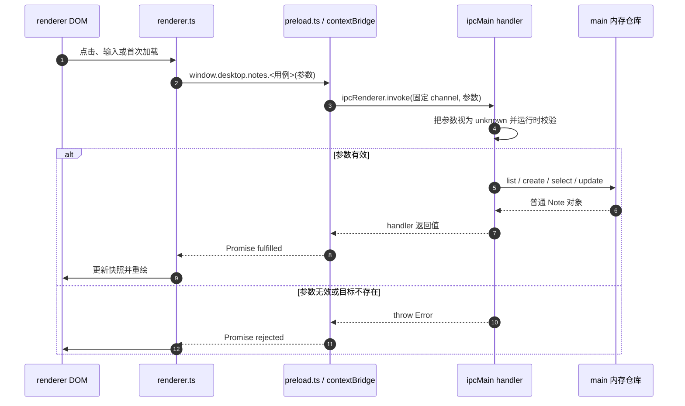

# 第 3 章：用类型化 IPC 跨越进程边界

## 本章目标

完成本章后，你能够：

- 把笔记数据的权威状态从渲染进程（renderer process）移到主进程（main process）；
- 用 `ipcRenderer.invoke()` / `ipcMain.handle()` 完成 list、create、select、update 四条请求—响应路径；
- 通过预加载脚本（preload script）只暴露具名、窄范围、类型化的 `window.desktop.notes` API；
- 区分 TypeScript 静态类型与主进程运行时输入校验，并让失败信息出现在页面状态区；
- 解释异步 IPC 对初始化、输入更新、错误处理和界面快照的影响；
- 在 DevTools 中证明 renderer 没有 Node.js 全局对象，也拿不到通用 `ipcRenderer`。

本章仍不做磁盘持久化。主进程内存仓库比第 2 章的 renderer 数组多跨过了一条进程边界，但应用退出后数据仍会消失。

## 前置条件

完成第 1 章和第 2 章。你应能区分 main、preload、renderer，理解 `BrowserWindow` 的安全配置，并能操作第 2 章的笔记列表与编辑器。继续使用 `examples/electron-notes`；Electron、TypeScript 和 Forge 的准确版本以 `package.json` 与锁文件为准。

本章保留前两章的以下结论：

- main 管理应用生命周期和原生能力，不操作 DOM；
- renderer 负责页面状态和 DOM，不直接导入 Electron 或 Node.js；
- preload 位于 renderer process 的隔离 context 中，是受控能力的适配层，不是业务数据库；
- `contextIsolation: true`、`nodeIntegration: false` 和 `sandbox: true` 保持不变。

## 组件职责与执行路径

| 组件 | 本章职责 | 明确不做什么 |
|---|---|---|
| `src/contracts.ts` | 定义可跨边界复制的数据类型、具名 API 与固定 channel | 不提供运行时校验，不保存数据 |
| `src/main.ts` | 持有内存仓库，注册 handler，校验所有未知 IPC 输入，返回可复制的普通对象 | 不信任 renderer 参数，不操作 DOM |
| `src/preload.ts` | 把四个具体方法映射到四个固定 channel | 不暴露 `send`、`invoke` 或整个 `ipcRenderer` |
| `src/global.d.ts` | 声明 renderer 可见的 `window.desktop` 类型 | 不创建运行时 API |
| `src/renderer.ts` | 调用 Promise API，维护显示快照与 `selectedId`，渲染成功或错误 | 不拥有权威仓库，不导入 Electron / Node.js |

这里的“权威状态”指业务操作最终读取和修改的来源。renderer 仍需一份 `Note[]` 快照来画界面，但每次 list、create、select、update 的结果都来自 main。若两份数据冲突，应以 main 返回值为准。



## 逐步讲解

### 第 1 步：先定义跨边界契约

`src/contracts.ts` 只包含普通数据和方法签名：

```ts
export interface NotesAPI {
  list(): Promise<Note[]>;
  create(): Promise<Note>;
  select(id: string): Promise<Note>;
  update(input: NoteUpdate): Promise<Note>;
}
```

返回值全部是 Promise，因为 `invoke()` 的响应是异步的。`Note` 和 `NoteUpdate` 只使用 string 与 number，可由 IPC 使用的 Structured Clone Algorithm 复制。不要跨 IPC 返回 `BrowserWindow`、DOM 节点、自定义 class instance 或函数；这些对象要么不能复制，要么复制后不保留原型语义。

channel 集中定义为 `notes:list` 等常量，避免 main 与 preload 各自手写字符串。冒号只是命名空间约定，不赋予 Electron 特殊行为。

### 第 2 步：让 main 成为唯一仓库

第 2 章的初始数组和同步 `NotesStore` 已从 `renderer.ts` 移到 `main.ts`。main 注册四个 handler：

```ts
ipcMain.handle(notesChannels.select, (_event, input: unknown) =>
  cloneNote(findNote(requireId(input))),
);
```

handler 的参数显式标为 `unknown`。虽然 preload 和 renderer 的 TypeScript 类型要求传 string，但页面运行时可能被 DevTools、注入脚本或未来的代码缺陷绕过。静态类型不能验证进程边界另一侧实际收到的值。

`cloneNote()` 让仓库内部对象不直接成为返回对象。IPC 本身会复制数据，但显式 clone 也使仓库函数的所有权语义清楚：调用方得到快照，不能靠修改返回对象改变仓库。

### 第 3 步：在 handler 入口做运行时校验

select 校验非空 string ID；update 先要求参数是非数组 object，再分别检查 ID、标题和正文：标题最多 80 字符，正文最多 100,000 字符。找不到 ID 时也抛出可理解的错误。

```ts
function parseUpdate(value: unknown): NoteUpdate {
  const input = requireRecord(value, '更新参数');
  return {
    id: requireId(input.id),
    title: requireBoundedString(input.title, '标题', 80),
    body: requireBoundedString(input.body, '正文', 100_000),
  };
}
```

校验发生在使用数据之前。不要用 `input as NoteUpdate` 代替校验；类型断言只改变编译器判断，不检查运行时值。当前 create 没有参数，list 也没有参数，因此它们没有业务 payload 要校验。

### 第 4 步：preload 只暴露具名用例

preload 可以导入 `ipcRenderer`，页面不能。它把四个方法逐一绑定到固定 channel：

```ts
const notesAPI: NotesAPI = {
  list: () => ipcRenderer.invoke(notesChannels.list) as Promise<Note[]>,
  create: () => ipcRenderer.invoke(notesChannels.create) as Promise<Note>,
  select: (id) => ipcRenderer.invoke(notesChannels.select, id) as Promise<Note>,
  update: (input) => ipcRenderer.invoke(notesChannels.update, input) as Promise<Note>,
};
```

页面只能表达“列出笔记”“创建笔记”“选择这篇笔记”“更新这篇笔记”，不能指定任意 channel。下面这种接口禁止出现：

```ts
// 错误：页面获得了通用消息能力
contextBridge.exposeInMainWorld('desktop', { send: ipcRenderer.send });
```

`contextBridge` 是权限边界的一部分，不是输入校验的替代品。preload 的类型有助于开发者，但 main 仍必须假定 payload 为未知输入。

### 第 5 步：让 Window 声明复用同一契约

`global.d.ts` 导入 `NotesAPI`，把它挂在 `window.desktop.notes` 上。这样 renderer 调用错误方法、漏字段或传错类型时会在 `npm run typecheck` 阶段失败。

类型声明与 preload 实现必须同时维护。只改声明会得到“编译通过、运行时报 undefined”；只改 preload 则会让可用 API 无法被 TypeScript 正确识别。

### 第 6 步：把同步 renderer 初始化改为异步

renderer 启动时先显示“正在从主进程读取笔记…”，然后 await `list()`。成功后保存显示快照、选中第一篇并绘制；失败时渲染空状态并把错误写入 `#status`。

```ts
notes = await window.desktop.notes.list();
selectedId = notes[0]?.id ?? null;
renderList();
renderEditor();
```

这里没有在 list 完成前假装数据已经存在。生产应用可以进一步禁用按钮或提供 skeleton；本章复用现有 HTML，因此使用状态文字表达加载阶段。

### 第 7 步：让 create 与 select 等待 main 返回

create 不在 renderer 生成 ID，而是由 main 使用 `crypto.randomUUID()` 创建记录。renderer 把返回的 Note 放入快照，然后调用 select；select 再经 IPC 确认该 ID 确实存在，最后切换 `selectedId` 和焦点。

选择也经过 main，看起来比纯本地查找多一次往返，但它有明确教学目的：完整练习带输入、带返回值、可能失败的查询路径。生产应用可根据多窗口一致性、数据规模和延迟决定选择是否必须访问 main。

### 第 8 步：串行化输入更新

输入事件可能比 IPC 响应更快。若所有 update 并发发送，较早输入有机会较晚完成并覆盖较新输入。renderer 用 `updateQueue` 将请求按产生顺序串行执行：

```ts
updateQueue = updateQueue.then(async () => {
  const updated = await window.desktop.notes.update(input);
  replaceNote(updated);
  renderList();
}).catch(showError);
```

每次事件都先捕获该时刻的 `{ id, title, body }`。队列失败后 `catch` 显示错误并把链恢复为 fulfilled，使后续输入仍可继续尝试。此策略简单可靠，但每个按键仍产生一次 IPC；生产版本通常加 debounce、批量保存、版本号或取消机制。

## 最小示例：一次双向调用

忽略 UI 后，最小闭环只有三段：

```ts
// main
ipcMain.handle('notes:list', () => notes.map((note) => ({ ...note })));

// preload
contextBridge.exposeInMainWorld('notes', {
  list: () => ipcRenderer.invoke('notes:list'),
});

// renderer
const notes = await window.notes.list();
```

教程工程比这个片段多出共享类型、运行时校验、四个用例和错误 UI，因为最小语法示例不足以表达真实边界。实际运行请使用统一 demo，不要另建玩具项目。

## 教学 demo：主进程内存笔记仓库

### 目的

验证现有笔记 UI 可以在 renderer 没有 Node.js / Electron 权限的前提下，通过窄范围双向 IPC 读取并修改 main 中的内存仓库。

### 目录与关键文件

```text
examples/electron-notes/src/
├── contracts.ts   # Note、NoteUpdate、NotesAPI、固定 channel
├── main.ts        # 内存仓库、运行时校验、ipcMain.handle
├── preload.ts     # contextBridge 与 ipcRenderer.invoke 适配
├── global.d.ts    # window.desktop 的编译期类型
└── renderer.ts    # Promise 调用、显示快照、选择与错误反馈
```

第 1、2 章的 `index.html`、`styles.css`、窗口尺寸、延迟显示和安全 `webPreferences` 没有变化。

### 运行前提与命令

在 `examples/electron-notes` 目录执行：

```powershell
npm ci
npm run verify
npm start
```

完成交互验收后终止开发进程，再执行：

```powershell
npm run package
```

### 预期结果

页面状态显示“主进程内存仓库已连接”，初始仍有两篇笔记。新建、编辑和切换均正常；列表内容取自主进程。应用完全退出并重启后恢复两篇初始记录，因为仓库没有写磁盘。

### 关键执行路径

renderer DOM event → `window.desktop.notes` → preload 固定方法 → `ipcRenderer.invoke` → main 运行时校验 → main 内存数组 → 返回普通对象 → renderer 更新快照与 DOM。

### 教学简化

保留了隔离、sandbox、关闭 Node integration、具名 API、固定 channel、输入验证、错误反馈和顺序更新。刻意省略磁盘持久化、schema 库、sender / origin 授权、多窗口广播、乐观并发控制、日志、重试、删除和自动化测试。若应用加载远程内容或允许导航，生产版本还必须按 Electron 安全清单验证每条 IPC 的 sender。

### 动手修改

为 create 增加可选初始标题。要求更新共享类型、preload 方法和 main 的 `unknown` 输入校验；标题仍不得超过 80 字符。不要增加通用 channel 参数，也不要让 renderer 生成 ID。

### 验收方法

运行 `npm run verify` 与 `npm run package`，再手工完成“新建 → 输入标题和正文 → 切到旧笔记 → 切回新笔记”。通过条件是内容不串写、状态无错误、打包成功，且 DevTools 中 `typeof require`、`typeof process`、`typeof window.desktop.send` 都是 `"undefined"`。

## 工程实践

### 用用例 API 表达最小权限

`list/create/select/update` 比 `send(channel, payload)` 更容易审查。新增能力时同时新增具名方法、固定 channel 和 handler，而不是扩大通用入口。

### 把进程边界当作不可信边界

TypeScript 只约束参与同一次构建且没有绕过类型的代码。IPC handler 仍对 `unknown` 做运行时验证。生产应用可用 Zod 等 schema 工具复用规则，但不应跳过验证。

### 返回可复制的数据

IPC 数据应保持 plain object、array、string、number、boolean 等可结构化克隆形状。不要让 renderer 依赖 main 内部 class、数据库连接或 Electron object。

### 设计可恢复错误

`ipcMain.handle()` 抛出的错误会让 `invoke()` Promise reject，跨边界后的 Error 不再是 main 中同一个对象。本 demo 只向用户显示 message；生产应用宜返回稳定错误码和安全文案，并把详细上下文写入主进程日志。

### 注册 handler 一次

handler 在 `app.whenReady()` 后、首次创建窗口前注册。macOS 重新创建窗口时不会重复注册，因此不会遇到同一 channel 已有 handler 的冲突。

## 常见错误

### 把整个 `ipcRenderer` 暴露给页面

这让页面可以尝试任意 channel，扩大攻击面，也破坏用例级审查。只暴露完成页面任务所需的具体函数。

### 相信 `NoteUpdate` 已经验证输入

interface 在 JavaScript 运行时不存在。DevTools 或其他脚本可以传入数字、数组或超长 string；main 必须检查实际值。

### 在 renderer 保留第二个可写仓库

renderer 可以保存显示快照，但 ID、更新时间和最终内容由 main 返回。若 renderer 自己生成并只偶尔同步，两边会形成冲突的权威来源。

### 忘记等待 Promise

把 `window.desktop.notes.list()` 当作 `Note[]` 会得到 Promise。初始化、创建和选择都必须处理 pending、fulfilled、rejected 三类结果。

### 并发提交每次输入却不定义顺序

网络或 IPC 请求完成顺序不能用直觉保证。本 demo 使用队列；数据量变大后应选 debounce、revision 或乐观并发控制，并明确冲突策略。

### 把 main 内存误称为持久化

状态移到 main 后可跨 renderer 页面刷新或窗口重建存活一段时间，但应用进程退出仍会丢失。持久化需要下一章之后的文件或数据库边界。

## 动手任务

### 任务 A：画出 update 的信任边界

从 input event 开始，写出 `renderer → contextBridge API → invoke channel → handler → repository → DOM`。标出 TypeScript 检查发生在哪里、运行时校验发生在哪里，以及 Error 在哪里被显示。

### 任务 B：增加带初始标题的 create

完成 demo 说明书中的修改。用正常标题和 81 字符标题各调用一次；正常请求创建记录，非法请求被 main 拒绝且页面能继续操作。

### 任务 C：动手故障实验——绕过静态类型

1. 启动应用并打开 DevTools Console。
2. 执行：

   ```js
   window.desktop.notes.update({ id: 'welcome', title: 42, body: '' })
   ```

3. 观察 Promise rejection，确认错误来自 main 的“标题必须是字符串”校验。
4. 为观察页面错误路径，临时在 `updateSelected()` 传入同样的非法值（可用类型断言绕过编译器），输入一次标题，确认 `#status` 出现“操作失败”。
5. 恢复临时故障，不提交类型断言或非法 payload；再次编辑，确认队列能恢复并显示连接成功。

这个实验说明：类型错误通常应在构建期被阻止；即使被刻意绕过，main 的运行时校验仍是最后防线。Console 直接调用只会显示 rejection，因为它没有经过 renderer 的 `catch(showError)` 路径。

### 任务 D：检查 renderer 权限

在 DevTools Console 依次执行：

```js
typeof require
typeof process
typeof window.desktop.send
typeof window.desktop.notes.list
```

预期依次为 `"undefined"`、`"undefined"`、`"undefined"`、`"function"`。再检查 `Object.keys(window.desktop.notes)`，只能看到四个具名用例。

## 客观验收

在 `examples/electron-notes` 执行：

```powershell
npm ci
npm run verify
npm run package
```

全部通过后启动应用，逐项验收：

1. 初始两篇笔记可见，状态文字确认已连接 main 内存仓库。
2. 新建空白笔记，标题输入框获得焦点，计数增加。
3. 输入标题和正文，左侧卡片最终显示相同内容且无错误。
4. 切到任一旧笔记再切回，新笔记内容不串写。
5. DevTools 中 renderer 没有 `require`、`process` 或通用 `send`，只有四个具名 notes 方法。
6. 用故障实验传入错误类型时 main 拒绝请求；恢复后正常操作仍可继续。
7. 完全退出并重启后恢复初始数据，并能解释 main 内存与磁盘持久化的差别。
8. `renderer.ts` 没有 Electron / Node.js import，preload 没有暴露整个 `ipcRenderer`。

静态检查证明类型和 lint 规则成立，打包证明生产入口可构建；二者都不能替代真实窗口中的点击、输入、切换与 DevTools 权限检查。

## 官方来源

- [Inter-Process Communication](https://www.electronjs.org/docs/latest/tutorial/ipc)：Electron 的 IPC 模式、`invoke` / `handle` 双向调用、channel 和错误传递。
- [`ipcMain` API](https://www.electronjs.org/docs/latest/api/ipc-main)：`ipcMain.handle()` 的 listener、返回值与错误语义。
- [`ipcRenderer` API](https://www.electronjs.org/docs/latest/api/ipc-renderer)：`invoke()` 的 Promise、Structured Clone 参数限制与 handler 配对方式。
- [Context Isolation](https://www.electronjs.org/docs/latest/tutorial/context-isolation)：隔离 context、TypeScript Window 声明以及不要暴露通用 IPC 方法的安全建议。
- [`contextBridge` API](https://www.electronjs.org/docs/latest/api/context-bridge)：桥接函数、参数/返回值复制限制与 `ipcRenderer` 暴露风险。
- [Security](https://www.electronjs.org/docs/latest/tutorial/security)：context isolation、sandbox、Node integration 与验证 IPC sender 的官方安全清单。

## 下一章衔接

现在笔记仓库已经离开 renderer，并有可验证的 IPC 边界，但仍随 main process 退出而消失。下一章可以保持 `NotesAPI` 的用例形状，把 main 内存数组替换为文件存储，并处理路径、原子写入、数据迁移和 I/O 失败；renderer 不应因此获得文件系统权限。
