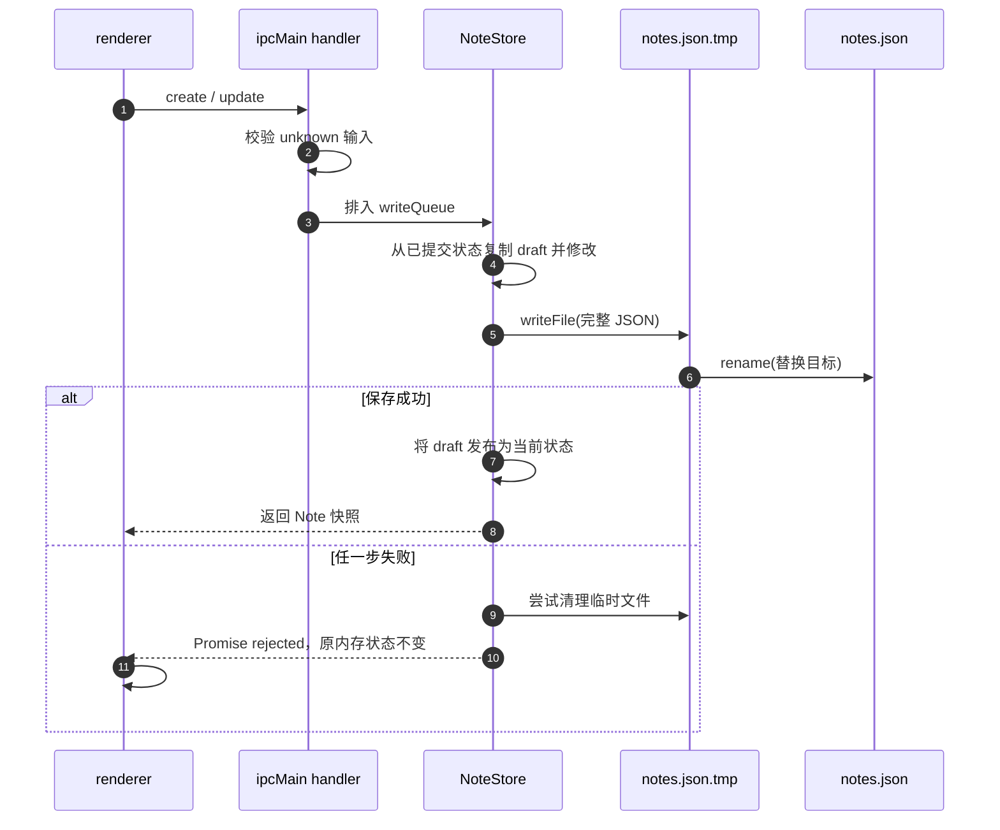
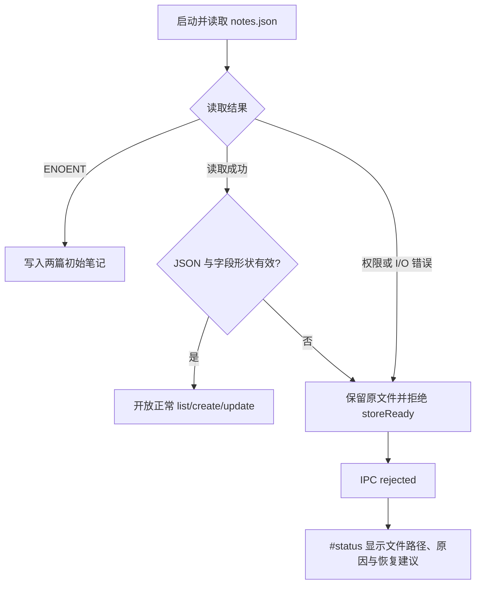

# 第 4 章：把笔记安全地持久化到本地 JSON

## 本章目标

完成本章后，你能够：

- 使用 `app.getPath('userData')` 为当前用户定位应用数据目录；
- 用独立 `NoteStore` 在启动时加载 JSON，并保持第 3 章的 list、create、select、update IPC 行为；
- 解释为什么写队列要覆盖“修改副本 → 写临时文件 → rename → 发布内存状态”的完整事务；
- 在 JSON 语法、字段形状或 ID 唯一性错误时保留原文件，并通过既有页面状态呈现可操作的错误；
- 实际证明笔记在应用完全退出、重新启动后仍存在；
- 判断教学用 JSON 文件何时应替换成 SQLite 等数据库。

## 前置条件

完成第 1–3 章，并理解 main、preload、renderer 的职责和类型化 IPC。继续使用 `examples/electron-notes`。本章不改 IPC channel、`window.desktop.notes`、preload 或 renderer；main 仍是权威状态持有者，只把底层仓库从内存数组换成磁盘文件。

准确依赖版本以 `package.json` 和锁文件为准。首次验证前在 demo 目录运行 `npm ci`。

## 组件职责与执行路径

| 组件 | 本章职责 | 明确不做什么 |
|---|---|---|
| `main.ts` | 在 app ready 后取得 `userData`，创建仓库并把既有 handler 委托给它 | 不直接读写 JSON，不改变 IPC 契约 |
| `note-store.ts` | 加载、校验、复制、串行修改和替换文件 | 不操作 DOM，不接受未经 main 校验的 IPC payload |
| `notes/notes.json` | 保存当前用户的笔记数组 | 不是项目源码，不应提交到 Git |
| renderer 的 `#status` | 显示 IPC fulfilled 或 rejected 的结果 | 不读取文件系统路径，不修复数据 |



关键不变量是：只有磁盘替换成功后，新 draft 才成为内存中的当前状态。因此 IPC 不能先报告成功、随后才发现保存失败。

## 逐步讲解

### 第 1 步：在 app ready 后解析用户数据路径

Electron 的 `userData` 默认是每个用户、每个应用独立的配置目录。`app.getPath()` 应在 app ready 后使用：

```ts
const store = new NoteStore(
  path.join(app.getPath('userData'), 'notes', 'notes.json'),
  initialNotes,
);
```

额外的 `notes` 子目录把教程数据与 Chromium 的 cache、cookies 等目录分开。不要把可变数据写到源码目录或打包后的 `resources`；安装目录可能只读，升级也可能替换其中内容。

### 第 2 步：只在文件不存在时写入初始笔记

`initialize()` 尝试以 UTF-8 读取文件。只有错误码为 `ENOENT` 时，仓库才复制 `initialNotes` 并首次保存。其他错误可能表示无权限、I/O 故障或内容损坏，不能等同于“第一次运行”。

这个区分防止一个危险行为：解析失败后自动写默认数组，会把用户唯一的损坏文件覆盖掉，连人工恢复机会也失去。

### 第 3 步：把 JSON 当作不可信持久化输入

`JSON.parse()` 只验证语法，不验证业务形状。仓库还检查：根节点是数组；每项是普通对象；`id`、`title`、`body` 和 `updatedAt` 类型正确且满足边界；所有 ID 唯一。

```ts
const value: unknown = JSON.parse(text);
if (!Array.isArray(value)) throw new Error('根节点必须是数组');
const notes = value.map(requirePersistedNote);
```

这里仍然不使用 `as Note[]` 逃过校验。文件可能由旧版本、用户手工编辑、磁盘损坏或其他进程产生，TypeScript 无法证明运行时内容。

### 第 4 步：让损坏文件保持原样

读取或校验失败时，`initialize()` 抛出包含文件路径、原因和恢复建议的错误，不调用 `persist()`。窗口仍会创建；renderer 首次调用 list 时收到 rejected Promise，现有 `showError()` 会把原因写到 `#status`。



教程选择“保留并报错”，没有自动创建备份副本，因为复制本身也可能失败并造成恢复语义含糊。生产应用可以在取得用户同意后提供导出、只读打开或有审计记录的恢复工具。

### 第 5 步：串行化整个 mutation

renderer 已把输入 update 串行发送，但 main 不能依赖某一个调用方永远守序。未来可能有多个窗口、菜单命令或后台任务同时写入。因此 `NoteStore` 自己维护 `writeQueue`：

```ts
const pending = this.writeQueue.then(async () => {
  const draft = this.notes.map(cloneNote);
  result = operation(draft);
  await this.persist(draft);
  this.notes = draft;
});
this.writeQueue = pending.catch(() => undefined);
```

队列涵盖状态计算与磁盘提交，不只包住 `writeFile()`。若两个调用先并行修改同一个数组、再排队保存，后写结果仍可能包含错误的旧快照。队列在一次失败后恢复，以便后续操作可以重试；当前调用获得原始 rejection，不会被伪装成成功。

### 第 6 步：临时文件完成后再替换目标

直接对 `notes.json` 调用 `writeFile()` 时，进程崩溃或磁盘写满可能留下截断 JSON。本章先完整写入同目录的 `notes.json.tmp`，再用 `rename()` 替换目标：

```ts
await writeFile(temporaryPath, serialized, 'utf8');
await rename(temporaryPath, this.filePath);
```

同目录可避免跨文件系统 rename。这个模式降低“目标文件只写了一半”的风险，但不是完整 durability 保证：教程没有 `fsync` 文件及父目录，也没有处理多进程竞争、备份轮换或磁盘级损坏。

### 第 7 步：保持 IPC 行为不变

main 仍在 handler 入口校验 renderer 参数，再委托给已初始化仓库：

```ts
ipcMain.handle(notesChannels.update, async (_event, input: unknown) => {
  const update = parseUpdate(input);
  return (await storeReady).update(update);
});
```

preload 和 renderer 不知道 JSON 路径，也不需要因存储实现变化而改动。list 返回数组快照；create 生成空白笔记并置顶；select 对未知 ID 报错；update 更新时间戳并返回保存后的快照。

## 最小示例：一次可提交的文件替换

下面是持久化机制的最小骨架，不包含 schema 校验与队列：

```ts
const target = path.join(app.getPath('userData'), 'notes', 'notes.json');
const temporary = `${target}.tmp`;
await mkdir(path.dirname(target), { recursive: true });
await writeFile(temporary, JSON.stringify(notes), 'utf8');
await rename(temporary, target);
```

它只说明“先写临时文件，再 rename”的顺序。可运行 demo 还需要输入验证、失败传播、状态复制和 mutation 队列，不能用这四行直接替代 `NoteStore`。

## 教学 demo：重启后仍存在的 Electron Notes

### 目的

验证现有类型化 IPC 背后已经连接本地 JSON 仓库，并以真实的关闭—重启证明持久化。

### 目录与关键文件

```text
examples/electron-notes/
├── package.json
└── src/
    ├── main.ts         # app 路径、IPC 校验与仓库装配
    ├── note-store.ts   # JSON 校验、写队列、临时文件替换
    ├── contracts.ts    # 沿用第 3 章公共契约
    ├── preload.ts      # 沿用窄范围 bridge
    └── renderer.ts     # 沿用异步 UI 与错误状态
```

### 运行前提、安装与运行

在 `examples/electron-notes` 执行：

```powershell
npm ci
npm run verify
npm start
```

在窗口中新建笔记，输入唯一标题和正文，等待左上状态恢复为已连接。完全关闭窗口，使开发进程退出；再次执行 `npm start`。最后执行：

```powershell
npm run package
```

### 预期结果

重启后，新笔记仍在列表中，标题与正文保持不变。首次运行会创建 `<userData>/notes/notes.json`。本切片受文件所有权限制，页面 footer 与成功状态中仍可能显示上一章的“内存”文案；它不代表实际存储位置，后续 UI 集成应统一这些标签。

### 关键执行路径

启动：app ready → 解析 `userData` → 读取并校验 JSON（或仅在 ENOENT 时创建）→ 注册的 IPC 等待 storeReady → renderer list。

保存：renderer input → update IPC → main 校验 → NoteStore 队列 → draft → 临时文件 → rename → 发布内存状态 → renderer 更新快照。

### 教学简化

本章保留了运行时 schema 边界、唯一 ID、串行写、失败不发布状态、临时文件替换和可解释错误。刻意简化了文件锁、跨进程并发、`fsync`、备份轮换、迁移版本、加密、查询索引、数据量上限和自动恢复。

JSON 适合单用户、小数据量、整份读写的教学 demo。生产笔记应用需要大量记录、全文搜索、部分更新、事务、迁移、多窗口写入或崩溃恢复时，应选 SQLite 等嵌入式数据库，并设计 schema version、migration、事务和备份策略。数据库也不自动解决密钥管理、权限或同步冲突。

### 动手修改

给文件根节点加入显式版本，例如 `{ "version": 1, "notes": [...] }`。要求：旧数组格式仍可读取；迁移只在完整验证后保存；未知较新版本必须报错并保留原文件。不要改 IPC 公共契约。

### 验收方法

通过条件全部可观察：

1. `npm run verify` 退出码为 0；
2. 新建并编辑一篇带唯一文本的笔记，关闭并重启应用后文本仍存在；
3. 连续快速输入后，重启显示最终文本而非中间文本；
4. 把测试用 JSON 临时改为无效形状后启动，状态区显示文件路径与原因，原损坏文件内容没有被默认笔记覆盖；恢复原文件后可再次启动；
5. `npm run package` 退出码为 0，并生成平台目录。

只操作为本 demo 明确定位的当前用户数据文件。验证前先备份；不要删除整个 `userData` 目录，因为其中还可能包含 Chromium 或其他课程状态。

## 工程实践

### 把写入成功定义为“磁盘提交成功”

只有 rename 成功后才更新 `this.notes` 并 resolve IPC。否则 UI 显示的“已保存”会与重启结果冲突。

### 让读等待正在进行的写

list 和 select 先 await `writeQueue`，从而不会在一次未完成 mutation 中间返回旧状态。更复杂系统可采用数据库事务或版本化快照，而不是无限增长的手写同步协议。

### 错误信息既要可操作，也要避免吞错

当前错误包含实际文件路径和校验原因，方便用户定位。清理临时文件失败被忽略，是因为主错误更重要且临时文件不会覆盖目标；生产应用应把清理失败写入受控日志。

### 给数据格式设计演进出口

本章的根节点只是数组，没有 schema version。这是明确的教学简化。产品发布前应加入版本字段和逐版本 migration，并用真实历史样本验证升级路径。

## 常见错误

| 症状 | 常见原因 | 定位与修复 |
|---|---|---|
| 每次启动都回到初始笔记 | 把文件写进源码目录，或把所有读取错误当 ENOENT | 检查 `app.getPath('userData')` 与错误码分支 |
| 快速输入后重启出现旧内容 | 写入并发，或队列只包住磁盘调用 | 串行化 draft 计算到内存发布的完整 mutation |
| JSON 偶尔无法解析 | 直接覆盖目标时进程中断 | 先写同目录临时文件，再 rename |
| 损坏文件启动后消失 | catch 中无条件写默认数据 | 仅 ENOENT 初始化；其他错误向 UI 传播 |
| TypeScript 通过但加载到错误字段 | 对 `JSON.parse()` 结果直接断言 `Note[]` | 把结果保持为 unknown 并逐字段验证 |
| 页面说“内存”但重启仍保留 | 上一章 UI 文案尚未集成更新 | 以重启行为和 JSON 文件为准，在 UI 所有权切片统一文案 |

## 来源

- [Electron `app` API：`ready` 生命周期与 `app.getPath('userData')`](https://www.electronjs.org/docs/latest/api/app/)
- [Node.js `fsPromises.readFile`](https://nodejs.org/api/fs.html#fspromisesreadfilepath-options)
- [Node.js `fsPromises.writeFile`](https://nodejs.org/api/fs.html#fspromiseswritefilefile-data-options)
- [Node.js `fsPromises.rename`](https://nodejs.org/api/fs.html#fspromisesrenameoldpath-newpath)
- [Node.js `fsPromises.mkdir`](https://nodejs.org/api/fs.html#fspromisesmkdirpath-options)

来源证实 API 的生命周期、路径语义和文件操作行为；串行 mutation、保留损坏文件、何时升级为数据库是本教程基于这些机制给出的工程设计。

## 下一章衔接

当前 demo 已形成“安全 IPC → 主进程校验 → 本地持久化”的闭环。下一章可以在不扩大 renderer 权限的前提下讨论菜单、快捷键或多窗口协调；若加入第二个窗口，首先要重新审视单进程写队列之外的状态广播与冲突策略。
