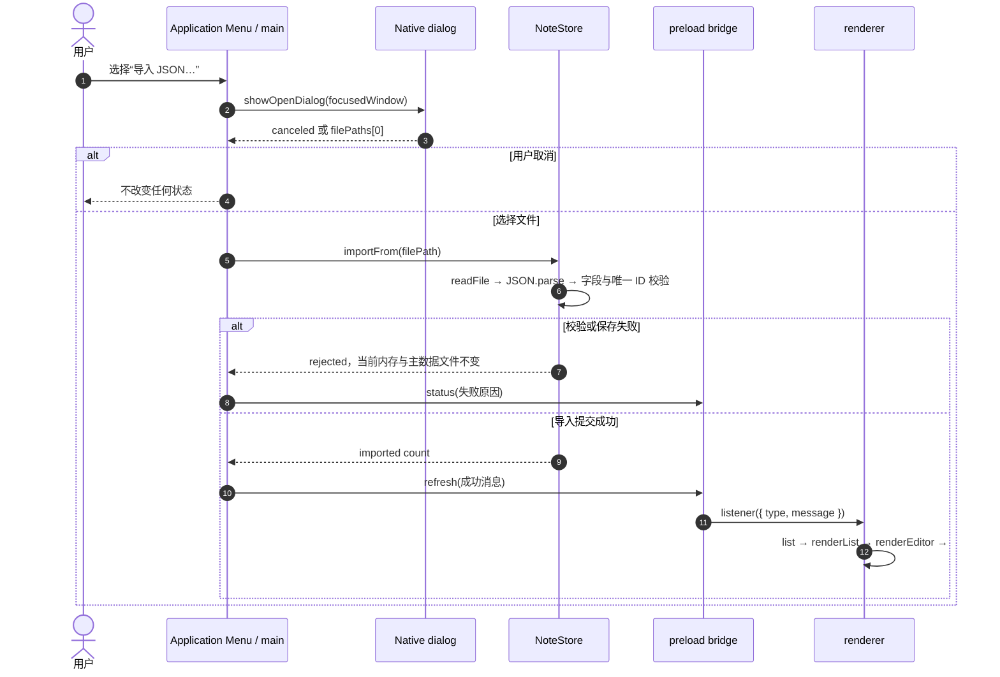

# 第 5 章：用系统菜单和文件对话框接入桌面操作系统

## 本章目标

完成本章后，你能够：

- 用 `Menu.buildFromTemplate()` 和 `Menu.setApplicationMenu()` 构建跨平台应用菜单；
- 用 menu role 获得系统原生的编辑、窗口和开发者工具行为；
- 处理 macOS app menu 与 Windows、Linux 文件菜单的结构差异；
- 在 main process 中用 `dialog` 取得导入、导出路径，不向 renderer 开放任意文件系统路径；
- 复用第 4 章的运行时 JSON 校验，让失败的导入不破坏当前笔记；
- 用窄范围 main → renderer 通知刷新界面或新建笔记。

## 前置条件

完成第 1–4 章，理解 main、preload、renderer、context isolation、类型化 IPC 和 `NoteStore` 的写队列。本章继续使用 `examples/electron-notes`，不增加页面控件：入口是操作系统菜单，结果复用页面已有的 `#status`。

准确依赖版本和命令以 `package.json`、`package-lock.json` 为准。首次运行前在 demo 目录执行 `npm ci`。

## 组件职责与执行路径

| 组件 | 本章职责 | 明确不做什么 |
|---|---|---|
| application menu | 提供新建、导入、导出、标准编辑、视图和窗口命令 | 不保存业务数据 |
| main process | 创建菜单和原生 dialog，持有用户选出的绝对路径，调用 `NoteStore` | 不把路径交给 renderer |
| `NoteStore` | 校验导入 JSON、串行替换当前数据、原子化导出快照 | 不显示 dialog，不操作 DOM |
| preload | 暴露 `onMenuCommand` 窄桥，并剥离原始 IPC event | 不暴露 `ipcRenderer.on` 或通用 channel |
| renderer | 响应 `new`、`refresh`、`status` 三种命令并更新页面 | 不读写文件，不选择路径 |



这条路径的安全边界是文件路径：它只存在于系统 dialog 的返回值、main process 和 `NoteStore` 调用栈中。renderer 不能提交 `C:\...` 或 `/etc/...` 让高权限进程读写。

## 逐步讲解

### 第 1 步：在 app ready 后安装 application menu

`Menu` 属于 main process API。应用 ready 后构造模板并设置一次全局菜单：

```ts
const template: MenuItemConstructorOptions[] = [
  ...(process.platform === 'darwin' ? [{ role: 'appMenu' as const }] : []),
  fileMenu,
  { role: 'editMenu' },
  { label: '视图', submenu: [{ role: 'reload' }, { role: 'toggleDevTools' }] },
  { role: 'windowMenu' },
];
Menu.setApplicationMenu(Menu.buildFromTemplate(template));
```

在 macOS，application menu 显示在屏幕顶端；在 Windows 和 Linux，它显示在窗口顶部。`Menu.setApplicationMenu(null)` 在 Windows、Linux 会移除菜单栏，本 demo 不这样做。

### 第 2 步：让 role 承担标准桌面行为

编辑菜单使用 `{ role: 'editMenu' }`，窗口菜单使用 `{ role: 'windowMenu' }`。Electron 根据平台生成 Undo、Redo、Cut、Copy、Paste、Select All、Minimize 等原生行为、标签和快捷键。视图菜单显式组合 `reload`、`forceReload` 和 `toggleDevTools` role，便于开发时定位 renderer 问题。

role 适合操作系统已经定义的动作。新建、导入、导出是本应用业务动作，因此使用 `label`、`accelerator` 和 `click`。同一项不要同时依赖 `role` 与自定义 `click`：Electron 文档规定设置 role 时会忽略 click。

### 第 3 步：显式处理 macOS 菜单约定

macOS 第一个顶层菜单应是 app menu，包含 About、Services、Hide 和 Quit 等系统动作。因此模板只在 `darwin` 前置 `{ role: 'appMenu' }`，文件菜单不再重复 Quit。

Windows 和 Linux 没有相同的 app menu 位置，本 demo 把 Quit 放在文件菜单末尾。`CmdOrCtrl` accelerator 会在 macOS 映射 Command，在 Windows、Linux 映射 Control。

| 平台 | 第一个顶层菜单 | Quit 位置 | application menu 位置 |
|---|---|---|---|
| macOS | app menu | app menu | 屏幕顶部系统菜单栏 |
| Windows | 文件 | 文件菜单 | 每个窗口顶部 |
| Linux | 文件 | 文件菜单 | 通常在窗口顶部，具体外观受桌面环境影响 |

平台条件只改变菜单编排，不改变导入、导出和笔记业务语义。

### 第 4 步：让系统 dialog 成为路径授权入口

导入使用绑定到当前 `BrowserWindow` 的异步 dialog：

```ts
const result = await dialog.showOpenDialog(window, {
  title: '导入笔记',
  properties: ['openFile'],
  filters: [{ name: 'JSON', extensions: ['json'] }],
});
if (result.canceled || !result.filePaths[0]) return;
await store.importFrom(result.filePaths[0]);
```

导出对应 `showSaveDialog()` 和 `result.filePath`。把 parent window 传给 dialog，可建立正确的窗口所有权；macOS 会把它呈现为附着于窗口的 sheet。取消是正常控制流，不显示错误，也不更改状态。

扩展名 filter 改善选择体验，但不是安全验证：用户仍可能选到内容与扩展名不一致的文件。真正的信任边界是 `NoteStore` 的运行时校验。

### 第 5 步：导入先完整验证，再提交状态

`NoteStore.importFrom()` 复用第 4 章的 `parseNotes()`：检查 JSON 根数组、每项字段类型与长度、有限时间戳和唯一 ID。只有读取与全部校验成功，导入数据才进入现有写队列：

```ts
const imported = parseNotes(await readFile(filePath, 'utf8'));
const pending = this.writeQueue.then(async () => {
  await this.persist(imported);
  this.notes = imported.map(cloneNote);
});
```

因此存在两层“不破坏现有数据”保证：解析失败时根本不排队；保存主数据文件失败时不发布新的内存数组。错误消息通过 `status` 通知显示“现有数据未更改”。

当前语义是“整库替换”，不是 merge。merge 需要定义 ID 冲突、时间戳优先级和用户确认，不能靠数组拼接临时决定。

### 第 6 步：导出一致快照并安全替换目标

`exportTo()` 先调用 `list()`，等待正在进行的写操作完成并取得 clone 快照，再写用户选择的目标路径。写文件沿用统一 helper：同目录创建带进程 ID 的临时文件，完整写入后 `rename()` 到目标，失败时尽力清理临时文件。

```ts
const temporaryPath = `${filePath}.${process.pid}.tmp`;
await writeFile(temporaryPath, serialized, 'utf8');
await rename(temporaryPath, filePath);
```

同目录避免跨文件系统 rename。它降低目标留下半份 JSON 的风险，但不是完整 durability 协议：本教程没有执行 `fsync`、备份轮换、文件锁或多进程协调。某些平台、文件系统或安全软件也可能让替换失败；失败会显示在 `#status`，不会伪装成成功。

### 第 7 步：用窄 bridge 发送有限命令

main → renderer 只有固定 channel `app:menu-command` 和 discriminated union：

```ts
type MenuCommand =
  | { type: 'new' }
  | { type: 'refresh'; message: string }
  | { type: 'status'; message: string };
```

preload 暴露订阅函数，而不是整个 `ipcRenderer.on`。包装器只把 `MenuCommand` 传给页面，不泄露含 `sender` 的 `IpcRendererEvent`，并返回解除订阅函数供更复杂页面生命周期使用。

`new` 复用 renderer 已有 `createNote()`，所以菜单和页面按钮共享同一条类型化 create IPC 路径；`refresh` 在成功导入后重新 list；`status` 只更新既有状态区。renderer 从未收到文件路径。

## 最小示例：菜单命令到页面通知

```ts
// main
click: () => focusedWindow.webContents.send('app:menu-command', { type: 'new' });

// preload
onMenuCommand: (listener) => {
  const handler = (_event, command) => listener(command);
  ipcRenderer.on('app:menu-command', handler);
  return () => ipcRenderer.removeListener('app:menu-command', handler);
};

// renderer
window.desktop.app.onMenuCommand((command) => {
  if (command.type === 'new') void createNote();
});
```

它展示控制流，不包含导入校验、错误呈现或共享类型。完整 demo 以 `contracts.ts` 作为两端契约，避免手写字符串和 payload 漂移。

## 教学 demo：通过系统菜单导入、导出 Electron Notes

### 目的

验证应用能以符合平台习惯的菜单调用原生文件选择器，同时保持 renderer 无文件系统路径权限。

### 目录与关键文件

```text
examples/electron-notes/
├── package.json
└── src/
    ├── main.ts         # application menu、dialog、路径所有权与操作编排
    ├── note-store.ts   # 运行时校验、整库导入和快照导出
    ├── contracts.ts    # MenuCommand、AppAPI 与 channel 常量
    ├── preload.ts      # 过滤 IPC event 的窄订阅 bridge
    ├── global.d.ts     # window.desktop 的 TypeScript 类型
    └── renderer.ts     # 新建、刷新与 #status 命令处理
```

### 运行

在 `examples/electron-notes` 执行：

```powershell
npm ci
npm run verify
npm start
```

验证 UI 后退出应用，再执行：

```powershell
npm run package
```

### 预期结果

Windows 上可见文件、标准编辑、视图和窗口菜单；role 的可见标签由 Electron 与操作系统本地化，可能显示英文。macOS 还会在最前显示 app menu。文件菜单可新建笔记、选择 JSON 导入、选择目标导出。编辑 menu role 可作用于当前输入框；视图菜单能切换 Developer Tools。成功或失败结果出现在 `#status`。

### 执行路径

新建：menu click → main 发送 `{ type: 'new' }` → preload 过滤 event → renderer `createNote()` → create IPC → `NoteStore`。

导入：menu click → open dialog → main 获得路径 → `NoteStore` 读取与校验 → 原子替换主数据 → `{ type: 'refresh' }` → renderer 重新 list。

导出：menu click → save dialog → main 获得路径 → `NoteStore.list()` 一致快照 → 临时文件与 rename → `{ type: 'status' }`。

### 教学简化

本章保留平台菜单结构、标准 role、异步原生 dialog、路径权限边界、运行时校验、写队列、临时文件替换和可见错误。刻意简化了 schema version 与 migration、导入预览、merge 冲突策略、最近打开列表、自动扩展名补全、文件锁、签名文件、备份、`fsync`、macOS sandbox security-scoped bookmark 和 Linux 桌面环境专项适配。

生产应用还应验证 IPC sender，限制可操作窗口和 frame；若加载远程内容，应落实 Electron Security Checklist 的导航、窗口创建、权限和自定义 protocol 等要求。

### 动手修改

增加“导入前预览”流程：main 读取并校验后只把 `{ count, newestUpdatedAt }` 等无路径摘要传给 renderer，用户确认后才提交。要求取消或校验失败不改变当前数据，并保持 renderer 无法指定任意路径。

### 验收

通过条件全部可观察：

1. `npm run verify` 退出码为 0；
2. 当前平台显示符合上表的菜单，编辑 menu role 和“切换开发者工具”可用；
3. 选择“新建笔记”后笔记计数增加且编辑器聚焦新笔记；
4. 导出后目标 JSON 可解析，数组长度与页面笔记数一致，目标旁没有遗留 `.tmp`；
5. 用另一份有效 JSON 导入后，列表刷新为文件内容且状态显示数量；
6. 导入语法错误、字段越界或重复 ID 的 JSON 时，状态明确报错，导入前笔记仍存在；
7. 取消 open 或 save dialog 后数据和状态不被伪报为成功；
8. `npm run package` 退出码为 0，并生成当前平台的 packaged application。

验证只创建专用临时 JSON；不要选择或覆盖真实用户文件。完成后删除由本次验证创建的文件。

## 工程实践

### 权限按能力划分，不按便利划分

renderer 需要“请求新建”和“收到刷新通知”，不需要 Node.js `fs`、dialog 或任意路径参数。窄 API 让 XSS 或页面逻辑错误可调用的能力保持有限。

### 菜单是命令入口，不是状态仓库

菜单只触发动作。笔记的权威状态仍在 `NoteStore`；renderer 在导入成功后重新 list，避免 main 和页面各维护一份导入结果并逐渐分叉。

### 将取消与失败分开

用户取消 dialog 是预期选择，直接返回。文件读取、schema 校验和写入失败才显示错误。把取消当错误会制造噪声，也诱导调用者用脆弱的错误字符串判断流程。

### 将 platform branch 集中在原生适配层

当前 `process.platform` 只控制 menu template。业务仓库和 renderer 不分平台，减少无法在当前系统实际运行的条件路径。

## 常见错误

| 症状 | 常见原因 | 定位与修复 |
|---|---|---|
| macOS 没有标准 app menu | 第一个顶层菜单不是 `appMenu` | 在 darwin 模板首项使用 app menu role |
| Windows 菜单没有 Quit | 误以为 app menu role 跨平台呈现相同 | 非 darwin 在文件菜单加入 quit role |
| Copy、Paste 对输入框无效 | 手写 click，未把动作交给当前 first responder | 使用 `editMenu` 或具体 edit role |
| 导入失败后原笔记消失 | 解析过程中直接修改共享数组，或先发布内存再保存 | 完整 parse 到局部数组，再进写队列并在 persist 后发布 |
| 页面能读取任意本机文件 | bridge 接受 renderer 传入的路径 | 由 main 调 dialog，bridge 不定义 path 参数 |
| renderer 能监听任意 channel | 暴露 `ipcRenderer.on` | 每个业务事件暴露专用包装函数并剥离 event |
| 导入成功但页面仍显示旧列表 | main 替换仓库后没有通知 renderer | 发送固定 `refresh` 命令并重新 list |
| 导出得到输入中间状态 | 快照未等待 write queue | `exportTo()` 通过 `list()` 等待当前写入 |
| dialog 后消息偶尔丢失 | 操作完成时没有可用目标窗口 | 保留发起 dialog 的窗口引用，并检查是否已销毁 |

## 来源

- [Electron Menu API](https://www.electronjs.org/docs/latest/api/menu/)
- [Electron Menus 指南：template、role 与平台菜单](https://www.electronjs.org/docs/latest/tutorial/menus)
- [Electron MenuItem API：role 与 click 的关系](https://www.electronjs.org/docs/latest/api/menu-item)
- [Electron dialog API：open、save、parent window 与取消结果](https://www.electronjs.org/docs/latest/api/dialog)
- [Electron Context Isolation：每个 IPC message 暴露一个窄方法](https://www.electronjs.org/docs/latest/tutorial/context-isolation)
- [Electron Security Checklist](https://www.electronjs.org/docs/latest/tutorial/security)
- [Node.js `fsPromises.readFile`](https://nodejs.org/api/fs.html#fspromisesreadfilepath-options)
- [Node.js `fsPromises.writeFile`](https://nodejs.org/api/fs.html#fspromiseswritefilefile-data-options)
- [Node.js `fsPromises.rename`](https://nodejs.org/api/fs.html#fspromisesrenameoldpath-newpath)

来源证实 Electron 和 Node.js API 的进程、平台及调用语义；整库替换、窄 `MenuCommand`、先验证后提交和本章生产简化是教程基于这些机制给出的工程设计。

## 下一章衔接

当前 demo 已把网页式 UI 接入系统菜单和文件选择器，同时守住 renderer 权限边界。第 6 章将在这套边界上继续完善安全与调试：收紧导航、窗口创建和 IPC sender 校验，并建立可重复的 main、preload 与 renderer 故障定位路径。完成这些运行时防线后，第 7 章再进入打包与发布。
