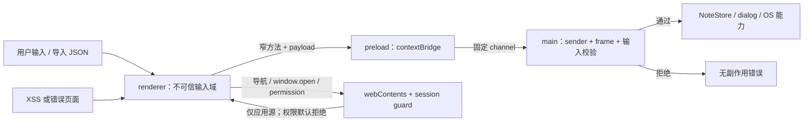
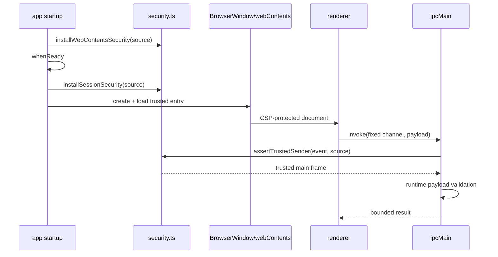
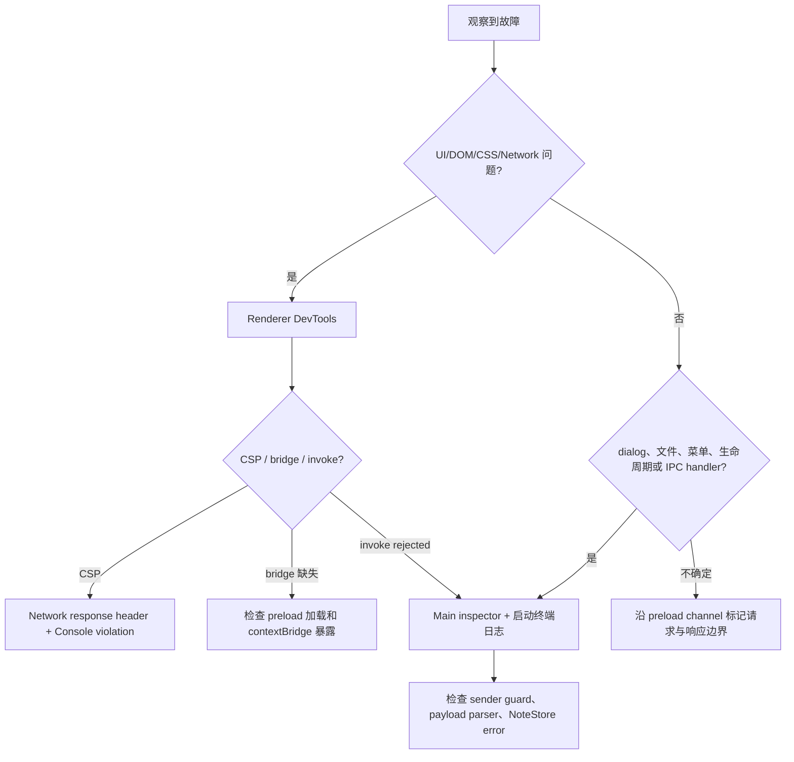

# 第 6 章：收紧安全边界并建立可重复的排障路径

## 本章目标

完成本章后，你能够：

- 把 Electron Security Checklist 转换为窗口、session、IPC 和 CSP 的可执行配置；
- 解释 `contextIsolation`、`sandbox` 与 `nodeIntegration` 各自限制的对象，而不是把它们当成同一个开关；
- 对全部 `webContents` 拒绝非应用导航、新窗口和权限请求；
- 验证 IPC sender、frame 与 payload，使页面不能把高权限 main process 当成通用后端；
- 分别调试 main process 与 renderer process，并按进程边界定位故障；
- 解读 `npm audit` 的直接依赖与传递依赖路径，选择可审查的升级策略。

## 前置条件

完成第 1–5 章，能够运行 `examples/electron-notes`，理解 main、preload、renderer、类型化 IPC、`NoteStore` 与 application menu。本章不增加业务功能；demo 是一组生产安全策略与 `security:check` 配置验证工具。

版本和命令以 demo 的 `package.json` 与锁文件为准。首次运行先在 `examples/electron-notes` 执行 `npm ci`。

## 组件职责与威胁边界

Electron 把 Chromium 页面和 Node.js/系统能力放在同一个产品中。renderer 中普通 XSS 的影响若能越过 preload 或 IPC 边界，就可能升级为本机文件读写或原生命令调用。因此安全目标不是“页面永远没有 bug”，而是页面出错后仍无法取得未授权能力。

| 组件 | 本章职责 | 不应承担的职责 |
|---|---|---|
| renderer | 渲染可信本地 UI，调用窄 bridge | 直接访问 Node.js、任意 channel 或权限 API |
| preload | 在隔离世界中暴露有限、类型化方法 | 透传 `ipcRenderer`、原始 event 或任意参数 |
| main process | 校验 sender 与输入，再执行系统能力 | 信任来自 renderer 的类型声明或路径 |
| `webContents` policy | 拦截导航和 `window.open` | 用字符串前缀猜测 origin |
| session policy | 默认拒绝权限，按环境注入 CSP | 在生产 CSP 中保留开发服务器能力 |
| `security:check` | 静态确认关键生产配置没有漂移 | 替代运行时攻击测试或制造 test hook |



## 三个隔离设置不是同义词

`nodeIntegration: false` 使 renderer 页面不能直接使用 `require`、`process` 和 Node.js built-ins，主要阻断“页面脚本直接获得 Node 权限”。它不能替代 preload API 设计；一个暴露任意文件路径读写的 bridge 仍然危险。

`contextIsolation: true` 让 preload 与页面运行在不同 JavaScript context。页面对 `window` 或内建 prototype 的修改不会直接污染 preload 的 context。跨边界能力应通过 `contextBridge.exposeInMainWorld()` 明确暴露。它限制对象世界的共享，不是操作系统 sandbox。

`sandbox: true` 让 renderer 运行在 Chromium sandbox 中，限制 renderer process 可直接接触的系统资源。Electron 文档说明启用 `nodeIntegration` 会关闭该 renderer 的 sandbox，因此三项应组合配置：

```ts
webPreferences: {
  preload: path.join(__dirname, 'preload.js'),
  contextIsolation: true,
  nodeIntegration: false,
  sandbox: true,
}
```

这三层仍不允许加载任意远程代码。Electron Security Checklist 的基本假设是：应用开发者必须控制加载源、导航、窗口、权限、IPC 和依赖更新。

## 逐步实现安全策略

### 第 1 步：把开发源与生产源建模为明确 allowlist

开发时 Electron Forge 启动 Vite，本应用只接受 `MAIN_WINDOW_VITE_DEV_SERVER_URL` 的精确 `origin`。生产时只接受打包 renderer 目录下的 `file:` URL：

```ts
const applicationSource = {
  devOrigin: MAIN_WINDOW_VITE_DEV_SERVER_URL
    ? new URL(MAIN_WINDOW_VITE_DEV_SERVER_URL).origin
    : undefined,
  rendererRoot: path.resolve(__dirname, `../renderer/${MAIN_WINDOW_VITE_NAME}`),
};
```

检查 URL 时使用 `new URL()`；生产文件使用 `fileURLToPath()`、`path.relative()` 判断是否位于 renderer root 内。不要使用 `startsWith('https://trusted.example')`，因为 `https://trusted.example.attacker.invalid` 也能通过这种前缀判断。

### 第 2 步：保护所有 `webContents`

只在 `createWindow()` 上注册策略容易漏掉后来创建的窗口或嵌入内容。本 demo 在创建任何窗口前监听 application-level `web-contents-created`：

```ts
app.on('web-contents-created', (_event, contents) => {
  contents.on('will-navigate', (event, navigationURL) => {
    if (!isAllowedApplicationURL(navigationURL, source)) event.preventDefault();
  });
  contents.setWindowOpenHandler(() => ({ action: 'deny' }));
});
```

`will-navigate` 不会拦截 main process 主动调用的 `loadURL()`，所以启动入口仍必须由 main process 固定。当前产品不需要第二窗口，因此 `setWindowOpenHandler()` 无条件拒绝；未来若要打开外部帮助页，应把 URL 解析、HTTPS host allowlist 与 `shell.openExternal` 明确放在 main process，而不是允许一个带 Node 能力的新窗口。

### 第 3 步：权限采用 deny-by-default

权限 handler 只能在 `app.whenReady()` 后访问 `session.defaultSession`。笔记应用不需要 camera、microphone、notifications、geolocation 等权限，因此所有请求都拒绝：

```ts
session.defaultSession.setPermissionRequestHandler(
  (_contents, _permission, callback) => callback(false),
);
```

若产品以后确实需要权限，批准条件至少同时校验 permission 类型、请求页面 URL、目标 frame 与当前用户动作；不要只按权限名称批准。

### 第 4 步：开发 CSP 与生产 CSP 分开

生产策略只允许同源 script、style、font 和 connection，并拒绝 object、base、frame ancestor 与 form submission。开发环境额外允许当前 Vite origin、对应 WebSocket origin和 HMR 注入的 inline style。策略由 `webRequest.onHeadersReceived()` 注入，因此同一份 HTML 不需要永久携带开发例外：

```text
生产：default-src 'self'; script-src 'self'; style-src 'self';
      connect-src 'self'; object-src 'none'; base-uri 'none';
      frame-ancestors 'none'; form-action 'none'

开发：在生产意图上仅增加精确 Vite HTTP/WS origin，
      并为 HMR style 注入增加 style-src 'unsafe-inline'
```

这里使用 `file:` 是教程当前构建事实。Electron Checklist 更推荐生产应用注册自定义 protocol；迁移时应把 production allowlist 与 CSP 的 `'self'` 行为一并验证，不能只替换 `loadFile()`。

### 第 5 步：IPC 同时验证 sender 和 payload

TypeScript 类型在编译后不会验证运行时消息。`parseUpdate()` 已检查对象形状、字符串类型与长度；本章再验证消息来自应用的 main frame：

```ts
function assertTrustedSender(event, source) {
  const frame = event.senderFrame;
  if (!frame || frame !== event.sender.mainFrame || !isAllowedApplicationURL(frame.url, source)) {
    throw new Error('拒绝来自非应用页面或子 frame 的 IPC 请求');
  }
}
```

每个 `ipcMain.handle()` 都先调用该 guard，再处理参数。sender allowlist 证明“谁在调用”，输入校验证明“调用内容是否在契约内”；两者缺一不可。即使当前 CSP 不允许 frame，检查 main frame 仍能防止未来页面结构变化时权限静默扩大。

### 第 6 步：把关键配置加入普通验证入口

`npm run security:check` 读取真实 `main.ts`、`security.ts`、`index.html` 和 `package.json`，确认隔离设置、IPC sender guard、导航、新窗口、权限、生产 CSP，以及 `verify` 的接线。它是配置漂移检查，不是测试框架，也没有要求生产代码导出 test-only hook。

```powershell
npm run security:check
npm run verify
```

静态字符串检查只能回答“关键配置仍存在”，不能证明所有 URL 编码、Electron 版本行为或运行时攻击路径都正确。生产项目应再配合代码审查、依赖扫描、打包后 smoke test 和针对真实 threat model 的安全测试。

## 教学 demo：Electron Notes 安全基线

### 目的

在不改变笔记功能的前提下，让开发环境保留 Vite HMR，并让生产包只加载自有内容；对每个 renderer 统一拒绝未授权导航、窗口与权限，对每条 renderer → main IPC 验证来源和输入。

### 结构

```text
examples/electron-notes/
├── index.html                  # 无固定开发 CSP；策略由 main 按环境注入
├── package.json                # security:check 接入 verify
├── scripts/
│   └── security-check.mjs      # 生产配置静态检查
└── src/
    ├── main.ts                 # 安装策略、窗口配置、IPC guard 调用
    └── security.ts             # source allowlist、CSP、权限与 webContents 策略
```

### 运行与预期结果

```powershell
cd examples/electron-notes
npm ci
npm run security:check
npm run verify
npm start
```

检查命令逐项打印 `PASS` 并以 0 退出。开发窗口正常显示，Vite HMR connection 不被 CSP 阻止；创建、编辑、重启持久化、菜单新建、导入/导出和切换 DevTools 保持可用。退出应用后运行 `npm run package`，应在 `out/` 生成 packaged application。

### 关键执行路径



### 教学简化

本章保留环境分离 CSP、全局 `webContents` policy、默认拒绝权限、main-frame sender 校验、payload 上限和静态配置检查。刻意简化了自定义 protocol、Electron fuses、code signing、ASAR integrity、自动更新签名、CSP report endpoint、证书 pinning 和第三方远程内容隔离；这些能力应在发布 threat model 中单独设计。

### 动手修改与故障实验

实验只在开发副本进行，完成后恢复，不要访问真实或危险站点。

1. 临时在 renderer DevTools Console 执行 `window.open('about:blank')`。预期没有新窗口；若有，检查 `setWindowOpenHandler` 是否在 `web-contents-created` 中对目标 contents 安装。
2. 临时给页面添加 `<a href="data:text/plain,blocked">本地拒绝实验</a>` 并点击。预期当前页面不离开 Electron Notes；若离开，检查 `will-navigate` 和 URL allowlist。实验后删除该链接。
3. 临时把 `sandbox: true` 改为 `false` 后运行 `npm run security:check`。预期出现 `FAIL renderer sandbox` 且退出码非 0。立即恢复并重新运行验证。
4. 在 DevTools Network 查看主文档 response headers。开发模式应看到 CSP，其中 connect source 只有当前 Vite HTTP/WS origin；Console 不应有 CSP violation。

不要为这些实验在生产代码加入隐藏 channel、绕过开关或仅供测试的导出。

### Demo 验收

1. `npm run security:check` 与 `npm run verify` 退出码均为 0；
2. `npm start` 后笔记 UI、保存和 application menu 行为正常；
3. Network 可观察到按开发源生成的 CSP，Console 无非预期 CSP error；
4. `about:` 或 `data:` 导航实验不替换当前页面，`window.open()` 不创建窗口；
5. DevTools Console 中 `typeof require === 'undefined'`；
6. `npm run package` 退出码为 0，packaged app 可启动；
7. 生产包页面 CSP 不含 Vite origin、`ws:` 或 `'unsafe-inline'`。

## 按进程边界调试

renderer 的 JavaScript、DOM、CSS、Network、Storage 和 CSP 使用窗口内 Chromium DevTools。可通过视图菜单的 `toggleDevTools` role 打开。main process 不在该页面 context 中；renderer Console 看不到 `ipcMain` handler、dialog 或 `NoteStore` 的调用栈。

main process 使用 V8 inspector。Electron 官方建议用 `--inspect=<port>` 或需要从第一行暂停时使用 `--inspect-brk=<port>`，再由 VS Code 或 `chrome://inspect` 连接。不要把 inspector port 暴露到非本机网络，也不要在发布命令中保留调试 flag。



常见症状与第一落点：

| 症状 | 首先检查 | 原因 |
|---|---|---|
| 页面空白或样式丢失 | renderer Console 与 Network | bundle 404、CSP、runtime exception 属于页面加载路径 |
| `window.desktop` 是 `undefined` | renderer Console + preload build output | preload 未加载、提前抛错或 bridge 名称漂移 |
| `invoke` 返回 rejected | main inspector/终端 | sender 或 payload guard、store、handler 抛错发生在 main |
| dialog 不显示或菜单命令无效 | main process 与 focused window | 原生 API 和窗口生命周期由 main 管理 |
| 整个应用冻结 | main CPU/同步 I/O | main process 也承担 UI 协调，阻塞会影响全局 |
| 只有 package 失败 | packaged 路径、CSP header 与资源 URL | dev server 和 `file:` 入口不同 |

## 正确解读 `npm audit`

`npm audit` 报告的是依赖图中的已知 advisory，不等同于“应用已被利用”。先记录 advisory、severity、受影响版本范围、依赖路径和修复建议，再判断该包是否进入 production artifact、漏洞前置条件是否可达，以及 Electron 自带 Chromium/Node 与 npm package 的边界。

传递依赖不能直接在 `package.json` 随意升级。优先顺序是：

1. 升级引入它的直接依赖到官方已修复版本；
2. 查看 lockfile 与 `npm explain <package>`，确认所有引入路径；
3. 在发布分支做最小、可回滚升级并重新执行 verify、package 和 UI smoke；
4. 只有上游尚未发布且兼容性已验证时，审慎使用 npm `overrides`，记录移除条件；
5. `npm audit fix --force` 可能跨 semver major，不应作为无人审查的默认动作。

不要只因 severity 很高就宣称可远程利用，也不要因它位于 devDependency 就自动忽略：构建工具供应链仍可能在开发或 CI 中执行。相反，无法进入运行路径、不可达的 advisory 可以记录风险接受依据和复查日期，而不是篡改 lockfile 隐藏结果。

## 工程实践与常见错误

| 错误 | 风险 | 修复原则 |
|---|---|---|
| 只给主窗口装 navigation handler | 后续 webContents 无保护 | 从 `web-contents-created` 统一安装 |
| 用 URL `startsWith` 做 allowlist | origin 混淆、编码与路径逃逸 | 用 WHATWG `URL` 与规范化路径判断 |
| permission handler 默认 `true` | 页面获得不需要的设备能力 | 默认拒绝，逐能力、逐 origin 批准 |
| 生产 CSP 保留 `ws:` / inline script | XSS 与外连面扩大 | CSP 按环境生成，只给 HMR 精确例外 |
| sender 合法就不检查 payload | 合法页面中的 XSS 可滥用能力 | sender 与运行时 schema 双重验证 |
| 类型断言当运行时校验 | 恶意 payload 绕过 TypeScript | 对 unknown 做形状、范围、长度校验 |
| renderer DevTools 调 main | 看不到正确 context 和调用栈 | main 使用外部 V8 inspector |
| 直接执行 `npm audit fix --force` | major 升级和行为变化混入修复 | 读依赖路径，做有界升级并完整回归 |

## 本章验收标准

- 能指出三种隔离设置分别保护的边界，并解释为何需要组合；
- 能从源码定位应用源 allowlist、全局导航/窗口 policy、权限 handler、CSP 和 IPC sender guard；
- 能运行 `security:check`，并通过受控改动观察它可靠失败；
- 能在 renderer DevTools 找 CSP/DOM 问题，在 main inspector 找 handler/文件/生命周期问题；
- 能用 `npm explain` 还原一条传递依赖路径，并提出不依赖 `--force` 的升级方案；
- demo 的 verify、package、UI 与安全实验满足前述客观条件。

## 来源

- [Electron Security Checklist](https://www.electronjs.org/docs/latest/tutorial/security)
- [Electron Context Isolation](https://www.electronjs.org/docs/latest/tutorial/context-isolation)
- [Electron Process Sandboxing](https://www.electronjs.org/docs/latest/tutorial/sandbox)
- [Electron `webContents` API](https://www.electronjs.org/docs/latest/api/web-contents)
- [Electron `session` API](https://www.electronjs.org/docs/latest/api/session)
- [Electron IPC 教程](https://www.electronjs.org/docs/latest/tutorial/ipc)
- [Electron Application Debugging](https://www.electronjs.org/docs/latest/tutorial/application-debugging)
- [Electron Debugging the Main Process](https://www.electronjs.org/docs/latest/tutorial/debugging-main-process)
- [Node.js WHATWG URL API](https://nodejs.org/api/url.html#the-whatwg-url-api)
- [Node.js Path API](https://nodejs.org/api/path.html)
- [npm audit command](https://docs.npmjs.com/cli/commands/npm-audit/)
- [npm package spec `overrides`](https://docs.npmjs.com/cli/configuring-npm/package-json#overrides)
- [npm explain command](https://docs.npmjs.com/cli/commands/npm-explain/)

Electron、Node.js 与 npm 官方资料支持 API 行为和安全建议；“统一全局拒绝、精确开发 allowlist、配置漂移检查与有界依赖升级”是本教程基于 Electron Notes threat model 作出的工程设计。

## 下一章衔接

本章确保开发和生产入口拥有明确安全边界。下一章进入打包与发布时，应继续验证 packaged CSP、资源路径、Electron fuses、code signing 与更新制品签名；发布流程不能为了方便重新打开 renderer 的 Node.js、窗口或网络权限。
