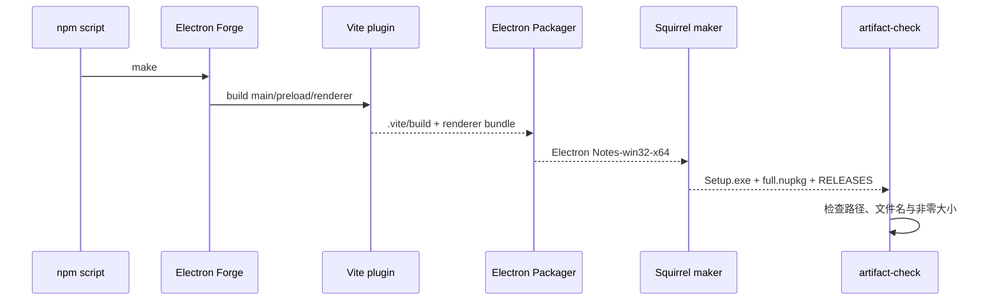

# 第 7 章：把可运行应用变成可维护的发布制品

## 本章目标

完成本章后，你能够：

- 区分 Forge 的 `package`、`make` 与 `publish`，并为每一步设置独立验收门；
- 生成带稳定产品标识的 Windows packaged application 和 Squirrel.Windows 安装制品；
- 检查 `app.asar`、可执行文件、安装器、更新包与 `RELEASES`，而不把生成物提交进 Git；
- 解释 ASAR、代码签名、公证、自动更新各自解决的问题与安全边界；
- 设计版本、release channel、secret 和跨平台 CI 策略；
- 对“能 package、不能 make、安装后不能启动、更新失败”做分层排查。

## 前置条件

完成第 1–6 章，并确认 `examples/electron-notes` 的开发启动、安全检查和本地持久化正常。本章在 Windows 验证 Squirrel.Windows；macOS ZIP 配置保留，但必须在 macOS runner 上签名、公证和验收。当前没有 Linux maker，原因与补齐条件见“跨平台构建边界”。

版本和命令以 `package.json`、`package-lock.json` 与 `forge.config.ts` 为准。从工程目录开始：

```powershell
cd examples/electron-notes
npm ci
npm run verify
```

## 三个构建阶段不是同义词

| 命令 | 输入 | 输出 | 回答的问题 |
|---|---|---|---|
| `npm run package` | 源码、Vite plugin、Electron runtime、`packagerConfig` | `out/Electron Notes-win32-x64/` | 应用能否离开 dev server 独立运行？ |
| `npm run make` | packaged application、maker 配置 | `out/make/` 下的安装/分发制品 | 用户如何安装，以及 updater 需要哪些元数据？ |
| `electron-forge publish` | make 制品、publisher 和凭据 | GitHub/S3 等远端 release | 哪些已验证制品被上传到哪里？ |

`make` 会先执行 package；`publish` 会经过 package 和 make 后调用 publisher。阶段可以串联，但验收不能合并：能生成 `.exe` 不代表安装器能安装，能安装也不代表远端上传、权限或更新 feed 正确。

本 demo 故意没有 `publish` script 和 publisher。教程没有真实仓库、release channel 与 secret 边界，增加一个“看似可用”的上传命令只会鼓励误发。生产项目应在 CI 中显式配置 publisher，并只允许受保护 tag/job 读取凭据。

```mermaid
flowchart LR
  S["受审查的源码 + lockfile"] --> V["verify"]
  V --> P["package：Vite build + Electron runtime + app.asar"]
  P --> PS["packaged smoke test"]
  PS --> M["make：Squirrel / macOS ZIP"]
  M --> A["artifact:check + 恶意软件扫描"]
  A --> C["代码签名 / macOS 公证"]
  C --> R["受保护 release job"]
  R --> U["分阶段更新 channel"]
  U --> O["崩溃率、安装率、回滚决策"]
```



图中的签名通常由 Packager/Maker 配置在制品产生期间完成，位置画在检查之后是发布门的逻辑顺序：只有签名和公证均成功的候选制品才可进入 release。签名后不得再次修改二进制，否则签名失效。

## 逐步配置可识别的产品

### 第 1 步：固定 npm 身份与产品身份

`package.json` 的 `name` 是 npm 兼容的机器名；`productName` 是面向用户的显示名。`version` 是本次 release 的应用版本，Squirrel 也用它命名更新包。作者与描述同时满足 Squirrel `.nuspec` 的必要 metadata。

```json
{
  "name": "electron-notes-tutorial",
  "productName": "Electron Notes",
  "version": "1.0.0",
  "author": "Electron Notes Tutorial Contributors",
  "description": "贯穿 Electron 教程的本地笔记应用"
}
```

不要在发布之间随意修改产品名、可执行文件名或 bundle ID。这些值会影响安装路径、快捷方式、macOS identity、权限记录和更新匹配；改名应作为迁移项目处理，而不是视觉文案调整。

### 第 2 步：配置 Packager metadata

```ts
packagerConfig: {
  asar: true,
  appBundleId: 'com.bughub.electronnotes',
  executableName: 'Electron Notes',
}
```

`appBundleId` 为 macOS bundle 提供反向域名形式的稳定标识；`executableName` 固定主可执行文件名；显示名来自 `productName`。真实产品应使用组织控制的域名命名空间。Windows installer 的 package ID 另由 Squirrel `name` 固定为无空格的 `ElectronNotes`。

### 第 3 步：让 maker 明确声明平台

```ts
makers: [
  new MakerSquirrel(
    {
      name: 'ElectronNotes',
      authors: 'Electron Notes Tutorial Contributors',
      description: '贯穿 Electron 教程的本地笔记应用',
    },
    ['win32'],
  ),
  new MakerZIP({}, ['darwin']),
]
```

Windows 的 Squirrel maker 生成三类关键文件：`Electron Notes-<version> Setup.exe`、`ElectronNotes-<version>-full.nupkg` 与 `RELEASES`。安装器面向首次安装；`.nupkg` 和 `RELEASES` 也组成更新 feed。macOS ZIP 是便于下载和更新分发的容器，但“压成 ZIP”不会自动完成代码签名或公证。

## ASAR 是封装，不是安全边界

`asar: true` 把应用 JavaScript、HTML、CSS 等资源收进 `resources/app.asar`，减少松散文件并简化路径。ASAR 不是加密：用户可以读取或解包内容，也不能据此保护 API key、许可证秘密或业务算法。

生产 secret 不应进入 renderer、preload、main bundle、source map、Forge config 或 CI log。必须在客户端使用的公开 API 标识不是 secret；真正的私钥和服务凭据应留在服务端。需要检测应用资源篡改时，应使用平台代码签名，并评估 Electron fuses/ASAR integrity；这仍不能让已分发客户端安全保存共享秘密。

原生模块或必须由操作系统直接读取的资源可能被 Packager 解包到 `app.asar.unpacked`。配置 `asar.unpack` 时应最小化匹配范围，并在 packaged application 中确认运行路径，不能假设所有文件都在 archive 内。

## 教学 demo：检查本地产物契约

### 目的

用真实 `out/` 验证 package 与 Squirrel make 的关键结构。检查脚本不制造制品、不读取远端、不需要证书，也不把 `out/` 纳入版本控制。

### 结构

```text
examples/electron-notes/
├── forge.config.ts             # Packager metadata 与平台 maker
├── package.json                # 产品 metadata 和命令入口
└── scripts/
    └── artifact-check.mjs      # 读取 out/ 并检查结构与非空 maker 文件
```

### 运行

```powershell
npm ci
npm run verify
npm run package
npm run make
npm run artifact:check
```

预期 `artifact:check` 对 packaged `.exe`、`resources/app.asar`、`resources.pak`、Setup executable、full NuGet package 和 `RELEASES` 分别打印 `PASS`，并以 0 退出。删除或重命名任意必需项后，脚本打印 `FAIL` 并以非 0 退出。

### 执行路径



### 教学简化

demo 保留稳定 metadata、ASAR、两个目标平台 maker、结构检查和实际 smoke test。它刻意省略图标、证书、notarization credentials、publisher、自动更新代码、SBOM、签名验证和病毒扫描，因为这些项目依赖真实组织身份与 release 基础设施。省略不代表生产可跳过；它使本地练习不要求也不泄露凭据。

### 动手修改

把 `package.json.version` 在临时分支改为 `1.0.1`，重新运行 `make`，观察 `.nupkg` 文件名和 `RELEASES` 内容如何变化。随后恢复版本和 `out/`；不要发布这次练习制品，也不要用同一版本覆盖已发布制品。

### Demo 验收

1. `npm run verify`、`package`、`make`、`artifact:check` 均以 0 退出；
2. packaged executable 可直接启动并显示 Electron Notes；
3. application menu 可创建笔记，关闭再启动后该笔记仍存在；
4. `out/make/squirrel.windows/x64/` 的安装器、`.nupkg` 与 `RELEASES` 均非空；
5. `git status --short` 不出现 `out/`、证书、token 或验证用笔记数据。

## 代码签名与 macOS 公证

代码签名证明制品由证书持有者发布，并让操作系统检测签名后的篡改；它不证明应用无漏洞。Windows 公开分发应对 executable 与 installer 使用 Authenticode 签名，并配置可信 timestamp server，使证书到期后仍能验证签名时刻。私钥应位于硬件/云签名服务或受保护的 CI secret store，不能提交 `.pfx` 和密码。

macOS 对 Developer ID 分发需要 signing 与 notarization：signing 建立作者和完整性，notarization 把已签名应用提交 Apple 自动检查，通常还要 stapling。Forge 的 `osxSign` 和 `osxNotarize` 应只在 macOS release runner 注入；Apple ID app-specific password、API key 等不得写入 config 或日志。Mac App Store 使用另一套签名与提交路径，不能与 Developer ID 流程混为一谈。

签名验收应使用平台工具检查最终下载文件，而不只看构建日志：Windows 用 `Get-AuthenticodeSignature` 或 `signtool verify`；macOS 用 `codesign --verify --deep --strict`、`spctl --assess` 和 `stapler validate`。这些检查必须在签名/公证所在平台执行。

## 自动更新是另一条发布协议

本章没有加入 updater，因为自动更新必须同时设计 feed、签名、channel、失败处理与回滚。Electron 内置 `autoUpdater` 支持 Windows 与 macOS；Linux 通常交给发行版 package manager。Squirrel.Windows feed 至少需要 `.nupkg` 与 `RELEASES`；macOS 自动更新要求应用已签名。

更新代码只应在 `app.isPackaged` 且明确的 release channel 中运行。至少处理检查失败、无更新、下载完成、用户延后、重启安装和遥测；不要在每次窗口创建时重复调用 `checkForUpdates()`。服务端必须以 HTTPS 提供不可变版本制品，发布 metadata 最后切换，避免客户端先看到尚未完整上传的 release。

稳定版、beta 与内部版应使用分离的 feed 和凭据。channel 选择不能允许 renderer 提供任意 URL；main process 只能从编译/受控配置中选择 allowlist endpoint。若更新导致数据 schema 迁移，必须先设计向前兼容、备份与回滚，因为旧二进制未必能读取新数据。

## 版本与维护策略

以 SemVer 管理应用版本：修复兼容 bug 增加 patch，向后兼容功能增加 minor，破坏用户/插件/数据契约增加 major。Electron runtime 升级不机械决定应用版本级别；应按实际用户可见兼容性判断，但每次 runtime 升级都执行 verify、package、maker、安装/更新 smoke 和安全审查。

每个公开版本号只对应一组不可变制品和 checksum。不要用同一 `1.0.0` 重新构建并覆盖远端文件，否则已下载客户端、`RELEASES`、签名和支持人员看到的内容会分叉。release 记录至少保留源码 commit、lockfile、runner OS/arch、制品 checksum、签名身份、发布时间和 channel。

依赖维护采用小步、可回滚升级。先处理 Electron 支持周期与可达安全问题，再升级 Forge/maker；不要把 runtime major、maker 更换和业务大功能塞入同一次 release。发布后监控启动失败、更新失败、crash、数据损坏和回滚率，达到阈值时停止 rollout，而不是继续扩大安装面。

## 跨平台构建边界

当前配置只声明 Windows Squirrel 和 macOS ZIP，没有 Linux maker。这是可验证范围，而不是宣称“不支持 Linux”：仓库没有 `@electron-forge/maker-deb`/`maker-rpm` 依赖，没有发行版 metadata，也没有 Linux runner 对 `.deb`/`.rpm` 安装、desktop entry、图标和 sandbox 集成做验收。凭空添加 maker 会生成未经支持的制品。

补齐 Linux 时，在 Linux CI 增加 Debian/RPM 中实际需要的一种 maker、维护者/分类/依赖 metadata，并在对应发行版容器或 VM 做安装与卸载 smoke。Linux 应优先通过发行版 package manager 更新，不能照搬 `autoUpdater`。

跨平台并不等于任意主机可完整构建所有目标：Squirrel.Windows 官方支持 Windows，或具备 Mono/Wine 的 Linux；macOS signing/notarization 需要 macOS 和 Apple 工具链。原生 Node module 还必须为目标 OS/architecture rebuild。最稳妥的 release matrix 是 Windows runner 产 Windows、macOS runner 产 macOS、Linux runner 产 Linux，并分别对 x64/arm64 做实际启动验收。

## Secret 与 release 权限

- 本地开发默认不持有发布凭据；普通 pull request job 永远不能读取 release secret；
- tag 触发不等于可信，release job 仍需 protected environment、最小权限和人工批准；
- publisher token 只授予目标仓库/存储桶的必要写权限，签名 key 与上传 token 分离；
- 日志不得打印环境变量、证书内容、临时 keychain 密码或带签名的 URL；
- 第三方贡献代码不得在能读取 secret 的 job 中执行任意 lifecycle script；
- 定期轮换并演练吊销，发现泄露时同时撤销凭据、停止 release、重新签名并通知受影响用户。

## 故障演练与定位

| 症状 | 第一检查点 | 常见原因 | 恢复动作 |
|---|---|---|---|
| `package` 在 Vite build 失败 | 最早的 TypeScript/Vite error | 源码、CSP 或配置错误 | 先让 `verify` 通过，不看 maker |
| packaged app 白屏 | `.vite/build`、`app.asar`、DevTools/log | dev URL 残留、资源相对路径、生产 CSP | 直接启动 package，按第 6 章分进程定位 |
| `make` 失败但 package 可启动 | Squirrel 输出和 metadata | 缺 author/description、文件名、进程占用 | 关闭运行中的 app，检查 maker 配置 |
| `artifact:check` 找不到 package | `out/` 实际 platform/arch | 在非 Windows 或非 x64 构建 | 用对应 runner，或扩展已验收目标契约 |
| Setup 安装后无快捷方式/不能启动 | Squirrel 日志、AppUserModelID、exe name | 身份漂移、安装中进程占用 | 固定 identity，清洁 VM 重试 |
| Windows SmartScreen/macOS Gatekeeper 阻止 | 最终文件签名/公证验证 | 未签名、签名后被改写、未 staple | 修复 release pipeline，不能让用户绕过 |
| 更新一直无版本 | feed URL、channel、`RELEASES` | metadata 未上传、版本复用、路径错误 | 原子发布制品后再切 metadata |
| 更新后数据打不开 | schema version 与迁移日志 | 破坏性迁移、无回滚路径 | 停止 rollout，从备份恢复并发布修复版 |

受控实验：先完成一次成功 `make`，将 `out/make` 临时改名后运行 `npm run artifact:check`，应只看到 make 项失败而 package 项仍通过。恢复目录后重新检查。不要为了让检查通过而降低断言或生成空占位文件。

## 本章验收标准

- 能用一句话准确说明 package、make、publish 的输入、副作用与输出；
- 能从 config 指出 bundle ID、executable name、Squirrel package name 和平台 maker；
- 能解释为什么 `app.asar` 可被读取，以及签名/公证分别提供什么保证；
- 在 Windows 从 `npm ci` 完整走通 verify、package、make、artifact check；
- 直接启动 packaged `.exe`，验证主界面、application menu 与重启持久化；
- 能列出 macOS release 仍需完成的 signing/notarization 验收；
- 能说明当前不生成 Linux 包的证据，并给出增加 maker 后必须补的 runner 验收；
- 能设计不向 pull request 暴露 secret、版本不可变、metadata 最后发布的 release gate。

## 来源

- [Electron Forge：Build lifecycle](https://www.electronforge.io/core-concepts/build-lifecycle)
- [Electron Forge：Configuration](https://www.electronforge.io/config/configuration)
- [Electron Forge：Makers](https://www.electronforge.io/config/makers)
- [Electron Forge：Squirrel.Windows](https://www.electronforge.io/config/makers/squirrel.windows)
- [Electron Forge：Code signing](https://www.electronforge.io/guides/code-signing)
- [Electron Forge：Signing a Windows app](https://www.electronforge.io/guides/code-signing/code-signing-windows)
- [Electron Forge：Signing a macOS app](https://www.electronforge.io/guides/code-signing/code-signing-macos)
- [Electron Forge：Auto updating from S3](https://www.electronforge.io/advanced/auto-update)
- [Electron：ASAR Archives](https://www.electronjs.org/docs/latest/tutorial/asar-archives)
- [Electron：Application Packaging](https://www.electronjs.org/docs/latest/tutorial/application-distribution)
- [Electron：Updating Applications](https://www.electronjs.org/docs/latest/tutorial/updates)
- [Electron：`autoUpdater`](https://www.electronjs.org/docs/latest/api/auto-updater)
- [Semantic Versioning 2.0.0](https://semver.org/)

Electron 与 Forge 官方资料支持构建阶段、maker、签名、公证、ASAR 与 updater 的平台事实；release gate、secret 分权、不可变制品和 rollout 规则是本教程面向 Electron Notes 风险模型给出的工程实践。

## 下一章衔接

至此，Electron Notes 已从进程模型、IPC、持久化、安全策略走到可检查的安装制品。后续工程化应把本章命令迁入按平台隔离的 CI matrix，并在拥有真实身份与发布端点后补齐签名、公证、publisher、更新 channel、回滚与生产可观测性。
